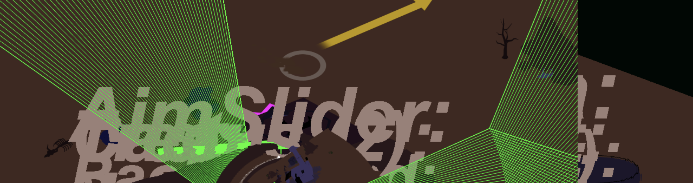

# *Tanks!?*

# Download for [Mac](https://github.com/pippinbarr/tanks-exclamation-mark-question-mark/releases/tag/mac) or [Windows](https://github.com/pippinbarr/tanks-exclamation-mark-question-mark/releases/tag/windows)

or

# [Play Online](https://www.pippinbarr.com/tanks-exclamation-mark-question-mark/webgl)

## Description
*Tanks shooting tanks! The tanks are upside down now?! Tank on tank action! Why is that cactus floating into the sky?! Shoot that tank! The sky seems to be green?! The shadows have all vanished?! That tank just drove down through the ground?! That oil derrick grew to three times its original size?! What is this, some kind of completely artificial videogame world?!*

*Tanks!?* explores the Unity game engine by taking the excellent *Tanks!* tutorial from Unity and seeking to modify it in ways that highlight different elements of the engine, from its treatment of 3D objects, to light, to cameras, and so on. It began life as a suite of minigames, each about a different element, but eventually morphed into a single game that gradually messes with as many parameters as possible to distort... everything.

## Press
Read the [Press Kit](../press) for press information

## Documentation
* Read the [Process Documentation](../process) for process journal entries, blog posts, to dos, and manifestos
* Read the commit histories for the [original](https://github.com/pippinbarr/tankses/commits/master) and [final](https://github.com/pippinbarr/tanks-exclamation-mark-question-mark/commits/master) repositories for detailed, moment-to-moment insights into the development process
* Look at the code repositories for the [original](https://github.com/pippinbarr/tankses) and [final](https://github.com/pippinbarr/tanks-exclamation-mark-question-mark) approaches to the project for source code etc.

## License
Christoph Peters's original _Tanks!_ tutorial code and assets are licensed under a [Creative Commons Public Domain Dedication (CC0 1.0)](https://creativecommons.org/publicdomain/zero/1.0/)

To the best of my knowledge, the starter scripts and other tutorial material in Unity's [Live Session: Pluggable AI With Scriptable Objects](https://unity3d.com/learn/tutorials/topics/navigation/intro-and-session-goals?playlist=17105) tutorial are also public domain.

Pippin Barr's modifications licensed under a [Creative Commons Attribution-NonCommercial 3.0 Unported License](http://creativecommons.org/licenses/by-nc/3.0/).
