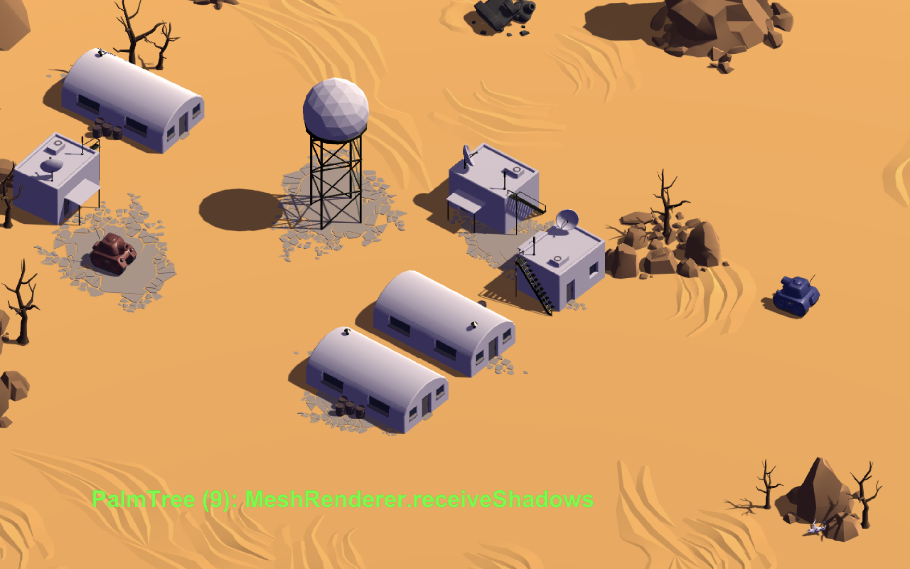
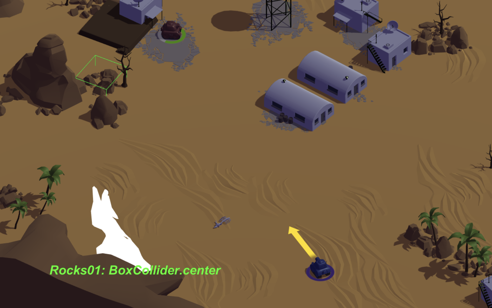
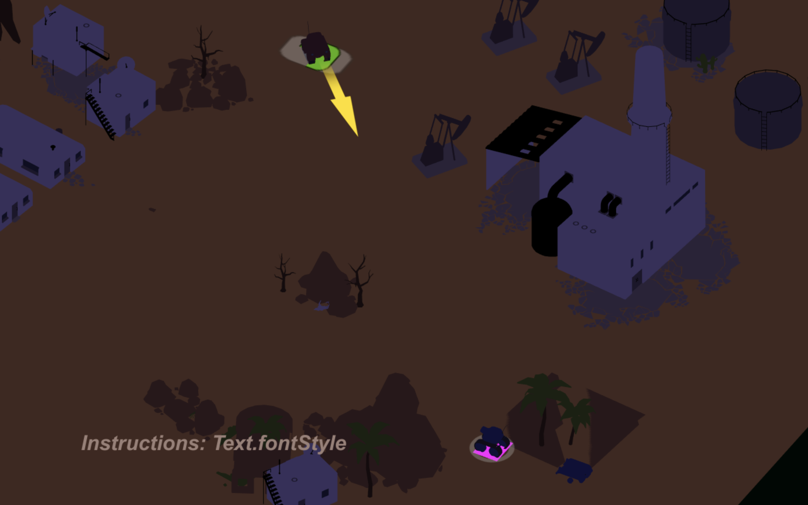
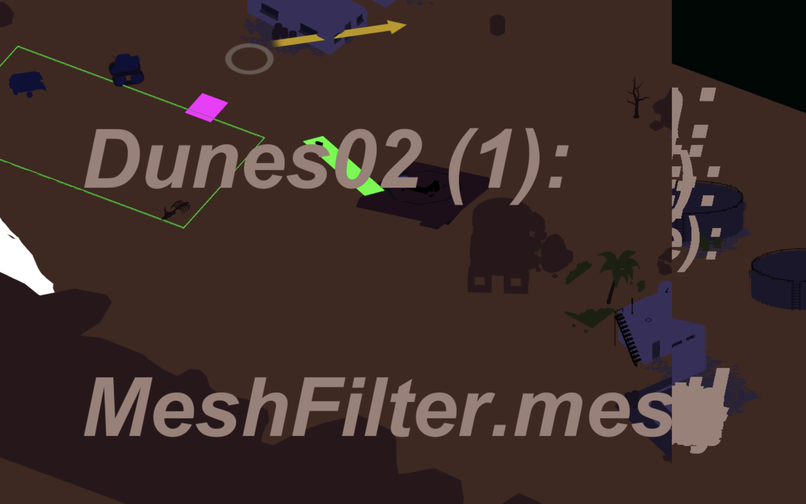
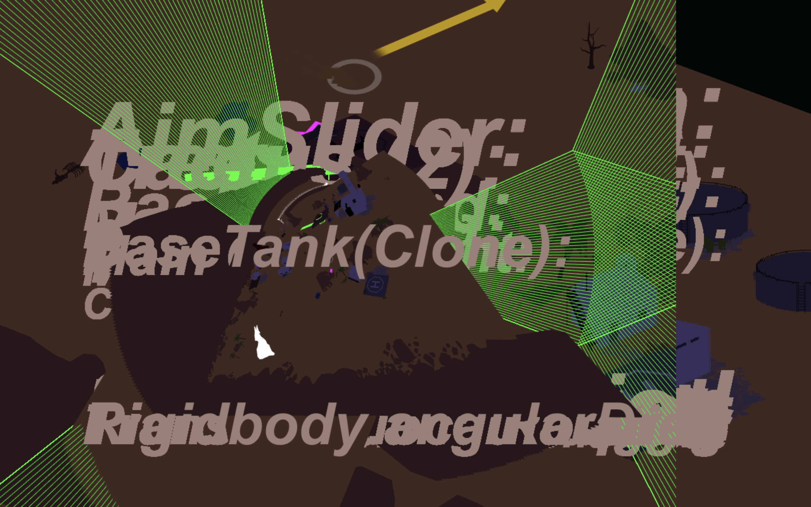
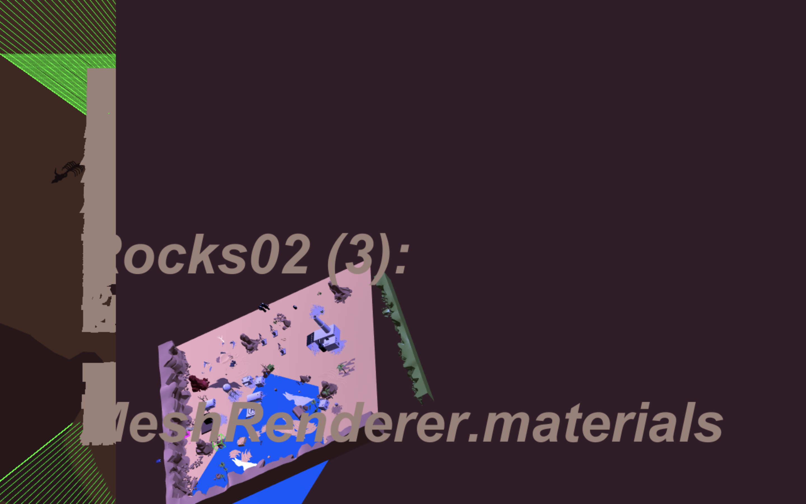

# _Tanks!?_ Press Kit

#### Download Tanks!?
* [Tanks!? for Mac OS X](https://github.com/pippinbarr/tanks-exclamation-mark-question-mark/releases/download/v1.0/tanks-exclamation-mark-question-mark-mac.zip)
* [Tanks!? for Windows](https://github.com/pippinbarr/tanks-exclamation-mark-question-mark/releases/download/v1.0/tanks-exclamation-mark-question-mark-windows.zip)

#### Play Tanks!? online
* [Tanks!? (WebGL)](https://www.pippinbarr.com/games/tanks-exclamation-mark-question-mark/)

## The basics

* Developer: [Pippin Barr](http://www.pippinbarr.com/)
* Release: 7 March, 2018
* Platform: Mac OS X, Windows, Browser (WebGL)
* Code repository: https://www.github.com/pippinbarr/tanks-exclamation-mark-question-mark/
* Price: $0.00

## Who is this Pippin Barr guy?

Pippin is an Assistant Professor in the [Department of Design and Computation Arts](http://www.concordia.ca/finearts/design.html) at [Concordia University](http://www.concordia.ca/) in Montréal.

He is the associate director of the [Technoculture, Art, and Games (TAG)](http://tag.hexagram.ca/) research centre, which is part of the [Milieux Institute for Arts, Culture, and Technology](http://milieux.concordia.ca/).

## Description

Tanks shooting tanks! The tanks are upside down now?! Tank on tank action! Why is that cactus floating into the sky?! Shoot that tank! The sky seems to be green?! The shadows have all vanished?! That tank just drove down through the ground?! That oil derrick grew to three times its original size?! What is this, some kind of completely artificial videogame world?!

## History

_Tanks!?_ grew from my many engagements with Unity's [Tanks Tutorial](https://unity3d.com/learn/tutorials/s/tanks-tutorial) as I tried to learn the engine. This year I had the idea of running my game design studio course at Concordia University by having students start with the Tanks! game from the tutorial and create variations on it. Philosophically, I wanted the class to focus on specific affordances of the Unity engine, so they're tasked with making three prototypes, one focused on Lights and Camera, one on Sound, and one on 3D Objects. These are all kind of "ontologically basic" categories of existence in the Unity engine.

Alongside the students, I wanted to create my own project along the same lines: a meditation on the nature of the Unity engine itself, but in the form of a game. This process turned out to be exceedingly arduous as I fought with the underlying design core of how to make such a thing. The process journals in [this repository](https://github.com/pippinbarr/tanks-exclamation-mark-question-mark/wiki/Process-Journal) and the [previous repository](https://github.com/pippinbarr/tankses/wiki/PROCESS) are exhibits of woe, confusion, and (hopefully) interesting ideas about the nature of Unity and its core categories.

All my stress was compounded by the fact that my class was meanwhile turning out _really_ impressive games based on the challenges I was giving them. I started to realise that my plan to build mini Tanks! games that played with the themes/meanings of different Unity Engine elements had been superseded by their work. There was no _need_ for me to do that work when they were already doing it - this was a really strange experience for me, but there you go.

In response to all this, I ended up focusing more on the core idea of _making the engine visible_ through play. That is, I wanted a version of the game that would expose the categories of the engine (camera, light, sound, 3D object, etc.). I decided the best way to do that would be to _change_ those elements during play, to reveal both how they are "arbitrary" in terms of being changeable, but also how crucial the specific point in "parameter space" the actual game represents is. As you change things, the game becomes unplayable (or at least "differently playable").

In the end, the game creates a kind of descent into chaos/entropy by cumulatively changing the parameters. Along the way, though, you can see precisely _what exists_ into the world of the game and _how_ it exists in terms of its parameterisation. Additionally, as the random changes are made, the game sometimes "discovers" forms of play not present in the original: flying tanks, a version of "prop hunt" thanks to mesh swaps, and so on. And of course the aesthetics of the game and its play become progressively more bizarre and, quite often, captivating: new colours, new orientations, new soundtracks are all presented to the player.

The player, hopefully, will be all like: "Tanks!?"

## Technology

*Tanks!?* was made in [Unity](http://unity3d.com) and is based on Unity's own [Tanks Tutorial game](https://unity3d.com/learn/tutorials/s/tanks-tutorial).

_Tanks!?_ is an open source game licensed under a [Creative Commons Attribution-NonCommercial 3.0 Unported License](http://creativecommons.org/licenses/by-nc/3.0/). You are looking at the code (and process and press) repository right now.

## Features

- Tanks!
- Randomness!
- Exposed engine inner-workings!
- Entropy!
- The parameter-death of the gameplay universe!

## Videos

### [Tanks!? Trailer](https://youtu.be/DvTVIp3JwJQ)

## Images

## Press

- Coming soon?

## Additional Links

- [Pippin's blog posts about Tanks!?](http://www.pippinbarr.com/search.html?q=tankses) (not many)
- [Process documentation of Tanks!?](https://github.com/pippinbarr/tanks-exclamation-mark-question-mark/wiki)
- [Commit history of Tanks!?](https://github.com/pippinbarr/tanks-exclamation-mark-question-mark/commits/master)
- [The original Unity Tanks Tutorial](https://unity3d.com/learn/tutorials/s/tanks-tutorial)

## Credits

* Pippin Barr: everything that isn't the original tutorial.
* Christoph Peters et al., Unity Technologies: the original tutorial

## Contact

* Email: [pippin.barr+press@gmail.com](mailto:pippin.barr+press@gmail.com)
* Website: [www.pippinbarr.com](http://www.pippinbarr.com/)
* Twitter: [@pippinbarr](https://www.twitter.com/pippinbarr)
* Facebook: [Pippin Barr](http://www.facebook.com/pippin.barr)
