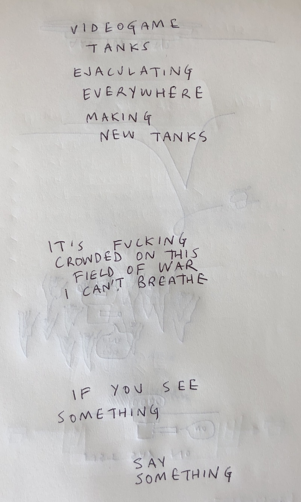

# Process Journal

A journal of process.

# 2017-12-28 18:12, in which we begin thinking about this project in earnest

Having finished _Sibilant Snakelikes_ this month (though I'm still contracted (by me) to write some post-mortem things) it's naturally time to start a new project. Because I'm teaching CART 415 this coming Winter semester and because I've decided to teach the course based around Unity's official TANKS! tutorial, it makes sense to me to use this as an opportunity to further explore Unity in a formal way. Specifically, the idea is to create (yet another) "variations game" around the completed version of the TANKS! tutorial. This is related to what I'll be asking the students to do in the course themselves (create variants/perversions of the game according to four specified topics), but I'll want to find my own conceptual framing that will make it worth doing beyond the basic fact of familiarising myself further with Unity as an engine.

I found _Sibilant Snakelikes_ a really successful way to explore the expressivity of the Snake mechanics via remediation, and in particular I like that the process felt at least somewhat rigorous. I had an overall question I was answering, and the design tasks I set myself (the subgames) felt like they forced me to address the question from different angles, hopefully building to some insights into design in that context. I want to do something related to that effectively for Unity itself in this case. That is I want to turn my gaze away from specific design/expression oriented questions toward technical questions. I think.

TANKS! is a nice testbed or experimental "instrument" in that it represents a totally cliched and banal vision of what a videogame is and should be. It's polished visually and with audio, it's designed to be fair, it focuses on accessibility and usability, and so on. There are countless design and implementation decisions evident even during the tutorial sessions that show how "normal" TANKS! is, and I think that's a positive. For one thing, there's nothing wrong with making a solid little game. For another, the fact TANKS! centres around a movement and shooting mechanic feels like something it would be good to explore, and it's something I haven't really worked with before. For one more, TANKS! is premised on the ways in which Unity specifically works to create games, and given how dominant Unity now seems to be in terms of independent game creation, and exploration of that engine is well worthwhile.

My early thought, then, is that TANKS!ES (which cutely reads a bit like TANKSIES) would be focused specifically on the technical affordances of Unity. My first idea around this is that I would go through one of Unity's menu systems (perhaps the Create menu) and attempt to create a variation on TANKS! based on each of the available ideas in that menu. That would yield:

- Empty
- Empty Child (hard to imagine how one would distinguish this from the above?)
- 3D Object
  - Cube
  - Sphere
  - Capsule
  - Cylinder
  - Plane
  - Quad
  - Ragdoll...
  - Terrain
  - Tree
  - Wind Zone
  - 3D text
- 2D Object
  - Sprite
- Light
  - Directional Light
  - Point Light
  - Spotlight
  - Area Light
  - Reflection Probe
  - Light Probe Group
- Audio
  - Audio Source
  - Audio Reverb Zone
- Video
  - Video Player
- UI
  - Text
  - Image
  - Raw Image
  - Button
  - Toggle
  - Slider
  - Scrollbar
  - Dropdown
  - Input Field
  - Canvas
  - Panel
  - Scroll View
  - Event System
- Particle System
- Camera

Now, looking at that list explicitly I'm worried about being able to consistently address each concept. It also illuminates that the 'question' here isn't clear enough. Am I asking what the expressive power of each of these primitive elements of the Unity engine's "cast of characters" is? Am I asking how to reframe the entirety of TANKS! in terms of that single entity? A version of TANKS! where everything is a Sprite? Where everything is an Input Field? Or is it more ambitious in terms of potentials for reframing/reimagining the interactivity of the game? A version of TANKS! where you control all aspects of play with sliders? A version of TANKS! where you move the tanks around using Wind Zones? Is the question what the different parts of the engine "naturally enable"? Some of them interactive, some of them purely visual? Is it interesting to make a version fo the game in which everything is a cube and another in which everything is a sphere?

Do I take each element of the game as a concept to redesign TANKS! around? A sphere becomes a planet that reframes how the tanks navigate? An Input Field leads to a text-input-based version of the game with the players frantically typing in orders to their tanks? An Audio Source frames the game as audio only? Am I on shaky ground if I do something like that, or is this legitimately a kind of design exploration of specific tools provided to me by the program?

Note that the Assets folder has a separate set of possible things to Create:

- Folder
- C# script
- Javascript
- Shader
  - Standard Surface Shader
  - Unlit Shader
  - Image Effect Shader
  - Compute Shader
  - Shader Variant Collection
- Testing
  - EditMode Test C# Script
  - PlayMode Test C# Script
- Scene
- Prefab
- Audio Mixer
- Material
- Lens Flare
- Render Texture
- Lightmap Parameters
- Sprites
  - Square
  - Triangle
  - Diamond
  - Hexagon
  - Circle
  - Polygon
- Animator Controller
- Animation
- Animator Override Controller
- Avatar Mask
- Physic Material
- Physics Material 2D
- GUI Skin
- Custom Font
- Legacy
  - Cubemap

Another exceedingly dry list of possibilities. I wonder to what extent these two lists somehow capture the "heart" of Unity? The other thing that would be part of that heart would be the set of available Components, too. There are many, many of those, some of which recreate some of the above (e.g. an Audio Source is just a Component on a GameObject).

Thinking about my experience with _Sibilant Snakelikes_ it's important not to _ignore_ the target game of TANKS! in this case. You can't just abstractly think about how a Lens Flare might relate to game design, you need to think about how it might relate to game design in the context of TANKS! (A Lens Flare implies distraction and being unable to see properly, to me, which further implies some kind of disadvantage in the context of two tanks trying to kill each other.)

Do I need some extra philosophical/affective/psychological content to this whole thing? As in, should I have a simulataneous project of trying to redesign/rethink TANKS! in terms of commentary/thought about violence in games more generally? Should each redesign/intervention be about "defusing" the original game's cheerful killing? I guess the question here is that if we're talking about using specific engine features we need to use them _in service of a design aim_ and that design aim needs to be grounded in something that isn't just the technical element itself. You need to have _something you're trying to do_ whether it's to "make a fun game" or "convey tragedy" or "tell your life story". How do I chose that second, parallel element?

To what extent am I bound to keep the basic premise of TANKS! intact? Does the resulting game still need to be "two entities try to eliminate each other with projectiles" or am I taking the bones of this things and twisting them any which way? Can I turn it into a Walking Simulator with a single tank as a response to the prompt of "Terrain"?

That idea of each engine element being a "prompt" for design has something to it perhaps. That it's not about some overarching message ("violence is bad") but about responding as a designer/creator to the material at hand. But responding through a pre-existing frame (of TANKS!) rather than starting with nothing at all and trying to make a game "about the Terrain tool in Unity"? TANKS! then serves "simply" as a set of available design moves to be taken/dropped/enhanced/reduce/twisted as needed in order to shape something that is a designerly response to the material being addressed - like "Cube" or "Sphere" or "Custom Font".

A little flash in my mind just now of the level titles simple being the specific menu item selected seems appealing. Like "Physic Material" is the title of a level/game. It comes up in white on a black background. Etc.

(I did have a thought that these interventions could also be seen as potentially _cumulative_. That each intervention based on an engine part could be on or off in any given playing of the game itself. As such they couldn't be total refigurings of the game but instead ideas that alter the original game through their presence. That's quite a different possible direction. Then "Animator Controller" becomes something that, when activated during play, changes the game according to its powers. This reminds me a bit of my idea of creating Pitfalls that were in response to Become a Great Artist in Just 10 Seconds.)

I can tell I'm not entirely comfortable with this project yet. At the highest level of "make a game that uses features of the Unity engine to make variations on a basic Unity tutorial game" the project makes sense and seems to be about the expressive/designerly features of the Unity engine "as a material". But drilling down it's obvious that it's hard-to-impossible to actually _do design_ without other key structuring principles. You can't just illustrate the properties and potentials of the engine-as-material without some additional direction/constraints.

To some extent the idea here is to expose what difference the _fact this game is in Unity_ makes to its composition and possibilities?

One factor at the base of all this is: Pippin learning Unity. A big part of even wanting to take on a project like this is the thought of improving my abilities with this super powerful tool. Even reading the list of "things that can exist" illustrates to me how far off understanding these things I am. There are so many tools that make no sense to me at all, to the point that I'd have to learn a lot just to being to think about how to design with them as the "primary material" in a redesign of TANKS!.

Is "Empty" just a version of the game with no represenation at all? Or is it a version of the game that is empty, with nothing in it? At which point it's kind of just a gag?

If the principles of TANKS! are

- Move skillfully so as not to be hit by enemy shells
- Fire your shells skillfully so as to hit your enemy
- (Observe/evaluate where your enemy is and where you are, and what the terrain looks like to facilitate the above)

Then is the idea that we think about how the materials of Unity can play into this core dynamic? Movement and Shooting? At which point do we come up with ideas such as something I've written down for CART 415 where "light" is reframed as your weapon? Could it be reframes as a form of movement?

If the verbs here are MOVE, SHOOT, EVALUATE (which is starting to get toward stuff written about Donald Norman in terms of affordances and those gulfs of execution and evaluation?) then is the project to find ways in which those verbs can be impacted by the aspects of the engine? At present, for example, there is an emphasis on components of the engine being levered toward making those verbs accessible, usable, fair - but what if we reframe those verbs to prioritise the potential of specific elements of the engine?

There's perhaps something there. But is it just that something like "Point Light" is inspiring in a way that something like Sprites > Hexagon really, really isn't? And isn't it true, by the way, that not every possible engine part makes any sense to choose as an intervention (on its own)? Like "Canvas" on its own does squarely nothing, is invisible, etc.

Well I suppose this has been at least somewhat productive. I need to think more though. And I will.

---

## 2017-12-30 15:55, in which we write some more words trying to find our way to something to hold onto

__What am I even doing?__

Let me say that this is kind of interesting as project because I'm "in The Method" right now without really knowing much of anything about what it is beyond 'variations based on TANKS!'. I guess, to be fair, _Sibilant Snakelikes_ began in much the same way, with only a vague idea of remediation of existing games. Here I have a similarly vague concept of 'thinking about the Unity engine' or something along those lines. So it's not like I haven't been here before. Nonetheless it's uncomfortable and somehow feels different (even if perhaps it isn't).

---

__Conversation with materials?__

One thing that I think this project may represent a chance to try is using Git branches to represent exploratory prototyping? In particular, because I'm not _that_ familiar with Unity as a tool, it may well be the case I need to feel things out with the materials more than I normally would - I can't necessarily 'think in Unity' in the same way I can 'think in Phaser' (or even 'think in Unity+First Person+Architecture'). And indeed the point of this project is, to some extent, a conversation with materials. As such we're kind of talking Reflective Practitioner? I should probably re-read at least my notes on that as a kind of grounding for this project. (Just like I read remediation and metaphor literature for _Sibilant_ right? Ha ha. As in, I didn't do it then so let's not assume I will now.)

But, ha has aside, maybe that idea of a "conversation with materials" is actually a useful structuring principle for this? Above I wrote about the idea of the combination of basic verbs of play (move, shoot, evaluate) and how they might interact with the potential of specific game engine parts (like points lights and UI canvases).

So can I set this up as a kind of triad? (Hi Bart.) Like there's the Designer (me), there's the material (Unity) and there's the... what, conceptual material? (TANKS! design). Triangles. Subject Tool Object?

This is at least feeling a bit like a frame? Then you could have a Git branch that represents a specific attempt at a conversation with specific material properties of Unity. So you open a branch that is about Light (or specifically Point Light?) and then you take the framework of TANK! and you look at it for affordances to introduce (Point) Light in a way that... what? There's a kind of creative/interpretive leap there that feels weird.

Like is it okay to say "well I'm just going to come up with something cool in TANKS! based on this element of the Unity engine"? I guess it's okay so long as the "something cool" is documented through its discovery and reasoning. I need to be able to think through _how_ the material and the design work together.

And what question is being asked and explored here? That's important. Yes you can be having a conversation with the materials, but what are we learning from that - especially given my status as a non-expert in the context of the materials specifically (even if I'm in some sense an expert in design). Look, what if we take a specific example that I've already thought about making in the context of CART 415 (which is another feature in this whole thing) and think about it. Odd because I haven't actually explored this in-engine, but still let's see...

---

__Light, by way of example__

So if I were to take _Light_ as an input/material (for now let's not worry about whether I should think in specific types of light). One idea I have is that the scene is unlit. The shells are replaced by Point Lights (fine with Real Time lighting). When you fire a shell it lands and instead of blowing up it stays there, illuminating the scene where it is. So we're talking about an interaction between SHOOT and LIGHT in this case. We could further imagine an idea that you take damage from light, so if you're within its sphere of illumination you're being damaged (could do this with a Trigger Collider that same dimensions as the sphere of illumination). This creates a relationship between SHOOT and EVALUATION that's different - you can't see your opponent or yourself unless in the light, but if you go into light to figure out where you are, you get damaged and potentially die, creating a trade-off and a potential need to a greater kind of 'kinesthetic awareness' on the part of the player to be able to drive around in the dark.

This idea could be complicated easily by layering more rules. Like the tanks could fire coloured lights such that they're not damaged by their own lights, so they could use them to figure out where they are AND to attack their opponent.

---

__Let there be light?__

But the instant you start thinking that way you have to ask yourself: _what is this about?_ The above idea is clearly an extension of/intervention into the TANKS! design that is inspired by LIGHT. It clearly leads to a related but different form of play. It might even be fun/entertaining. But what is it telling us? Why that specific kind of intervention and not something completely different? Why not Light in terms of dramatic illumination in the style of German Expressionist Cinema, for example? Why one approach and not another?

This raises one question/idea: rather than creating a game that has one version based on one part of the engine, what if you made TANKS!ES: LET THERE BE LIGHT, for example, and made a suite of games that were entirely about using Unity's lighting system to create variations on TANKS!

Again there's a suspicious lack of rigour and, somehow, of intelligence here? But is that somehow okay? What if I just suck it up and say, well, I'm going to make a set of variations of TANKS! all of which use Unity's lighting capacity to create new gameplay affordances and aesthetic possibilities? And I learn what I learn along the way? Still feels pretty loosey goosey? Not much to grab onto there? I'd learn plenty about just implementing different shit in Unity, I might make some semi-entertaining games, but does this _tell me anything about light in Unity_? It's not clear that it does.

If I did use this higher level strategy I'd have

- TANKS!es: Light
- TANKS!es: 3D object
- TANKS!es: 2D object
- TANKS!es: Audio
- TANKS!es: Video
- TANKS!es: UI
- TANKS!es: Particle System
- TANKS!es: Camera

Which is starting to seem like it could be kind of intriguing? Like how to refactor a simple game (TANKS!) by using a specific form of material that a game engine deems _fundamental_ to its ontology. These are the things that exist as kind of first-order entities inside Unity. To then attempt to work with those fundamental materials in order to explore how they could lead to different forms of play is an interesting idea. In this case TANKS! is just a kind of patsy - it's not that important that it's TANKS! specifically (other than it being a kind of Ur game).

It lacks a bit in terms of being TOTALLY FORMAL in a way I'm fond of, but it's no less formal than something like PONGS, which had no objective other than "what small changes can I introduce to Pong in order to make it a different game?". And PONGS was revelatory in a lot of ways. Splitting this out into multiple different games makes the task seem more interesting to me. Rather than having the "one true Point Light" game, we have a whole bunch of different Light games that seek to explore the design affordances of Light, at least in the context of a highly traditional videogame.

Okay this is beginning to sound like something I believe in.

I'm all like, "Hi materials, I'm Pippin. I'd like to get to know you better."

---

__Ugly Piece of Shit Behemoth?__

I think I'll start with Light.

I'm now realising I need separate repos for each of these games? DO I? Or do w... yes, ... well...

No maybe I don't unless I'm worried about it becoming gargantuan? Technically all these approaches use the same underlying code and assets (except 3D object which will use others presumably). So I could build them all in the same project but then create separate executable RELEASES which I release over time.

I'm kind of stressed out about file management with Unity after _v r 3_ became such an ugly piece of shit behemoth.

In my dreams this whole thing works because I'm ultimately building on top of TANKS! and TANKS! on its own is something like 187MB as a project, which is not by any stretch of the imagination overly enormous. And actually somehow SOMEHOW 76MB of that is just in the lighting for a single scene? Raises the question of whether scene lighting is going to be horrible. BUT if I switch entirely to realtime lighting that becomes a non issue? But these are the kinds of questions I think I need to ask as practicalities.

Note that this isn't in terms of just making the game in general, because who really cares how large it gets. These are questions that _The Method_ requires me to ask. Because I need to be able to make the source of the thing available. Not so much for open sourcing (though that's a nice thing to think and care about) but because I need the commit history and for that to work the whole thing has to fit online properly. And therefore the repo needs to be under 2GB or so. Now obviously that's not a problem here, but I end up concerned about the repo being svelte or something. Haha. Harharhar. har.

Okay so there's a boring step at the start which is creating the minimal project that successfully represents the Unity Tanks Tutorial final outcome with the fewest possible files in it. And from there I can being with Git branches for each separate approach (e.g. Point light shells or whatever) and then merge them as successful when they're not (I guess I only merge when their scene 100% works?). Have to be careful about prefabs and so on and not changing them just for a single version - if I seriously need a prefab to change I should create a new one.

Those sorts of emerging 'rules' for development are part of this whole thing and are important. The desire to kind of maintain the purity of the initial project is important. As in, ideally if I'm making a project out of Light then I should only really be changing things related to light (e.g. adding lights, changing the overall lighting, changing scripting in relation to lighting, etc.). That's quite a nice constraint for me really and should make the rules of design a little clearer and the 'conversation with materials' a little easier to hear. If I may. I may.

Alright kid, I think you could start this game. And if you start this game you're effectively preparing for CART 415 because talking about this could actually end up being the main form of lecturing for me personally and my main contribution to discussion. I guess I don't know if I'll manage to go at at their pace? That's a different concern though. That's fine. But this does make me notice that I'll need a separate Unity project in which I can build versions of TANKS! in relation to weekly discussions. They'll be significantly more hacky that what I attempt to produce for my releasable version.

---

__Titling?__

TANKS!ES is the base name. I think currently that it makes the most sense to release differnet suites of variations as completely separate builds, rather than trying to release one megabuild that I update over time with 'DLC'. So

- TANKS!ES: LET THERE BE LIGHT! (LIGHT)

? If I want to have kind of comedy titles? Better than the boring alternative of just literally having the Unity Create Menu title. Yeah. So then...

- TANKS!ES: (SOUND)
- TANKS!ES: (3D OBJECT)
- TANKS!ES: (2D OBJECT)
- TANKS!ES: I AM CAMERA! (CAMERA)
- TANKS!ES: (UI)
- TANKS!ES: (PARTICLE SYSTEM)
- TANKS!ES: (VIDEO)

Actually as I try to come up with comedy names I'm kind of fucking failing and I suddenly wonder if the boring alternative is better?

- TANKS!ES: CREATE > LIGHT

Just straight up referencing the literal Unity Materials in question? Pluralise?

- TANKS!ES: LIGHTS
- TANKS!ES: CAMERAS
- TANKS!ES: AUDIOS < that kind of sucks
- TANKS!ES: USER INTERFACES
- TANKS!ES: 2D OBJECTS
- TANKS!ES: PARTICLE SYSTEMS

It mostly works okay. "AUDIOS" sucks. Bleah.

---

__How much is enough?__

Question: how many variations do you need to consider one of these games done? Do I set a hard limit to reach in every single one, like 10? Do I just "feel it" and the different things have different numbers of engagements? I think the latter is probably more fair. But maybe a minimum to avoid having a single 'variation'? Need at least, say, five versions in order to be able to see some kind of conversation between versions and discern some kind of ... knowledge-thing... from them... oh god writing.

Let's say (for now) a minimum of 5, no maximum.

---

__How will design proceed?__

One nice thing here is that because I legitimately don't know so, so much about Unity, I'm going to need to really do the conversation with materials thing more fully and immediately than usual. Normally there's of course a conversation with Phaser as I work out finer points of design via development, but generally speaking I can "think in Phaser" as I design such that I can write a bunch of design ideas based on knowing the kind of thing I can achieve. Here that's not really true, so it's likely a significant amount of the design process is going to be

- Sitting in the engine trying stuff out
- Reading the actual documentation of the Unity elements seeing what's possible (especially in terms of the scriptable properties of these things)
- Probably looking up what other people have done in terms of those elements

Honestly I'm quite excited by this project at this point. I think it has real merit as an exploration of the engine as material and I think it's experimental form is pretty legitimate.

---

__Next steps__

- Create minimal version of the TANKS! project (useful for CART 415 too)
- Set the repo ... well it's already in motion so that's fine
- Start playing around (perhaps by making that first version of the game)

I suspect that actually building out a light-based version of the game is going to throw me back into some interesting/trouble considerations of the actual underlying concept here, so I'll look forward to that potential agony when it comes.

---

## 2017-12-31 10:10, in which I've officially created the base Unity project with TANKS! in it and I think about how even that was surprisingly stressful

Okay, so I bit the bullet and created the base version of the game. That is, it's the Unity TANKS! tutorial CompleteGame setup. I deleted all the stuff that was the incomplete versions from the setup so I didn't commit them as they're not of interest in this context. But also...

__LightingData__

One of the things that stresses me out with Unity + Git is the size of the projects. I don't know if it's a stupid worry (it might be), but I fret that the whole thing will become massive and unmanageable and eventually I won't be able to upload it anymore. Now, TANKS!ES isn't likely to fit that bill I don't think? There's aren't masses of assets to put into the game, which are the big space-takers - though there will inevitably be a bunch of audio and 3D and 2D assets that will have to go in I guess... but presumably not maaaaaaassive? Well I suppose that's a question that will come with time.

When I was checking the actual size of the folder for the game I ended up sleuthing around to see what was big. And one of the big things is the LightingData for the CompletedGame scene. Initially I felt like this was unnecessary/redundant because the game uses Realtime Lighting. So I deleted it thinking it made no difference. But of course when I played the game it was a bit darker now, so clearly the LightingData was for something (I mean, it's kind of obvious that it would be). So I looked up LightingData a bit and found that because the game uses Realtime Precomputed GI, if you want precomputed GI you still have to Generate Lighting and therefore generate a (large-ish) LightingData file. Given that I'm going to end up with a bunch of scenes in this project (like as many as 60+???) it seemed like that could get out of hand quickly... like 1GB of lighting data or something? There's another part of me that wonders whether Unity can tell if you have duplicate or related lighting data and therefore won't actually recompute it for scenes where it's not relevant? But any changes to the 3D world and any changes to the lighting would presumably necessitate distinct LightingData files, so it could still be big.

My solution for now has been to delete the LightingData and to rely entirely on Realtime light, no precomputation. It may well turn out there are major reasons _not_ to do that, but the advantage here is that if it's a problem I can just generate the lighting and it will be okay. The big risk seems to be around expensive computation during play that could create lag, so I'll just monitor that as I go along. I'm also perfectly willing to believe I'll see some weird fucked up lighting because of this... and again, I'll deal with that when it comes to me.

This _isn't_ especially interesting in terms of design right now, but it's a good illustration of the complexities of learning a new system, and the complexities of the many interlocking parts involved in a project like this... from Git to GitHub to Unity to LightingData and so on. Have to be able to hold it all in your head to some extent _from the beginning_ so as to make decisions that don't fuck you over later on. So, I'm trying mom.

__CART 415 and project organisation__

This project is intimately related to my CART 415 course this year in that I'm asking the students to pursue a similar kind of experimental exploration of the Unity engine in the context of the TANKS! tutorial game. I'm not asking them to do it in the same way or spirit as me and I'm not asking them to document to the insane level I'm favouring here, but TANKS! in Unity is going to be our core object of study.

To that end I initially duplicated my TANKS!ES project folder to have a version that I'd do CART 415-related manipulations in, but now I'm wondering about that. Given that the CART 415 project and discussion is around _exactly what I'm doing for TANKS!ES_, would it not make sense to do my explorations of ideas for CART 415 _in the TANKS!ES_ project. Otherwise I'm effectively splitting the same thinking and investigations artificially in two, and in terms of The Method, that seems like it could be problematic. There's no real distinction between me making exploratory versions of TANKS! to show and discuss with the class and me making "proper" versions of TANKS! that will form the games/levels of TANKS!ES, right?

I guess my only concern is about a kind of profusion of files and mess in the project that could get out of hand, but perhaps that can just be managed by being careful with folder structures. Notably it would make sense for me to separate out Prefabs, Scripts, Scenes etc. for the different iterations of TANKS!ES. And in terms of CART 415 the four projects are basically versions of TANKS!ES I'm thinking about anyway... "Lights, Camera" correspond to two of my versions, "Sound" corresponds to one, "Space and substance" corresponds (I guess) to "3D Objects" and "Interface" corresponds to UI (along with some other scripting). I guess the biggest difference I see in there is just that I'm intepreting "Interface" to include controls for CART 415, but I don't intend to do any of that in TANKS!ES (it's not implied by the Create menu I don't think).

So I guess my thought is that every new Scene is a _branch_ in the repository (so I desperately have to fucking remember to actually create those branches oh my god). And this would go for experiments to show the class as well as more designed ideas to implement for TANKS!ES proper. And they get merged into the main project when they're done (or done enough to be considered a specific part of the project), or never merged if they're not useful for whatever reason. (It would also be possible to do work that I don't actually want in the project in branches that I could switch to with SourceTree during class?)

Or another idea here is that CART 415 experiments are _perpetually_ in a CART 415 branch of the project, and that they then sometimes no doubt feed into branches that are for actual games to build? I don't actually know what a good structure is here. The experimentation for CART 415 seems like it's reflective of a specific level of development for TANKS!ES, more feeling your way, trying out cheap tricks that might be developed further (because obviously week to week I'm not going to have time to flesh out all these possibilities - I can only really attempt things that are relatively simple).

So should there be an 'explorations' branch from the beginning that contains all of the exploration stuff, and then other named branches would be specifically for versions of the game I'm looking to merge into the main project? That kind of makes sense? Definitely going to need to use SourceTree from here on. Fine. I will. (It's better for The Method anyway in terms of the ability to quickly view specific commits.)

Yeah okay, so there thing would look like (oh wait I think maybe an explorations for each subgame makes sense to keep them a bit more organised?). The explorations branches would _never be merged_. The subgames branches would be merged when they were done (enough) to become part of the master (not clear to me when that moment is, but I guess I'll feel it out). So the branches are...

- master (the project itself)

- light-explorations
- camera-explorations
- ...

- light-darkroom-sex-tanks (or whatever, I mean that's a hilarious idea though, whoa, but this would be an actual version of a game for the light collection - I'd use the prefix just to be organised)
- ...

This is all sounding kind of daunting and huge as a project at this point, but I need to remember that actual individual games for the collections are _not_ meant to be that insanely big and details.

__Ready, player one?__

With that, I suspect I'm ready to actually begin on this beautiful journey and just start seeing what happens. At a certain point you do have to just Let Go Let God and suffer the consequences. There's no question I'll have calculated badly wrong about various of the ideas here and that certain aspects of the project will be a nightmare. A main guiding light here, weirdly, is just being able to track and report on those failures I expect to have. More than anything I just don't want the repo to get so fucked up that it's no longer possible to view it and understand what's happening.

One great thing here is that I'm introducing an extra level of detail with the branching which I'm hopeful about (as well as all the Unity learnin' obviously). This will be a chance to see how Baby's First Branching relates to the The Method world. We all have an assumption it's a positive, but nobody has really tackled it in a project so, here I am, on the front lines, stepping on mines. For you, the viewer.

That's it. I've written inordinate amounts already about this game I haven't started making, but I think I've written myself into a place of at least understanding what's ahead of me and what I'm looking to achieve. Hi. It's me. Your son.

---

# 2018-01-01 18:32, in which I write what I imagine to be a post for my site summarising this new project

(Posted.)

## New Project: TANKS!ES

The New Year has begun and I'm thinking through the new game project that's going to occupy me for the next little while. For me, it represents an interesting constellation of concerns that manage to tie together my teaching and my research and multiple levels, so that's fun?

So, the game (or rather, the overall series, as this will be a series work) is called _TANKS!ES_. As you might imagine from the titling, it's me taking on another variations-oriented project. The minimal description of the project is that I'll be making variations of the game that is the result of Unity's excellent [TANKS! tutorial game](https://unity3d.com/learn/tutorials/s/tanks-tutorial). I've personally done that tutorial about three or four times now because I find it really helpful in terms of a sensible Unity workflow and seeing a decent survey of how Unity works. In the case of _TANKS!ES_, of course, it gets a bit more complicated. There are a number of streams of thought coming together for this project:

__Formal variations__. I find the process of working through distinct variations on a game to be a hugely generative and informative way to think about videogame design and videogame composition and videogame aesthetics and so on. As I've made more and more variations, I've tended to want more serious formal constraints on the process and I think in general having 'rules' (like a specific game I'm remediating in _[Sibilant Snakelikes](https://pippinbarr.github.io/sibilant-snakelikes/)_, say) leads to a more interesting project that can be thought about more deeply. In the case of _TANKS!ES_ the formal variations are based around the Unity engine itself, as that's my subject of experimentation here. Specifically, I'm going to create a series of collections of variations based on the top level of Unity's _GameObject_ menu. That is (excluding Empty Object and Empty Child for now) 3D Object, 2D Object, Light, Audio, Video, UI, Particle System, Camera. The idea will be to create variations on the _TANKS!_ tutorial game that respond to the implications and possibilities of each of those fundamental ontological categories in Unity. (Obviously I could talk about this at greater length, but that will do for now.)

__CART 415__. This semester I'm teaching my Game Studio course in my department at Concordia University. Year to year I've never completely settled on a way to teach the course other than knowing I want it to be an approach to experimental game design for the students. In the past I've perhaps pushed too hard on experimental being kind of aggressively obtuse/difficult/unfun, I guess because my work can trend that way. This time through I want experimental to be about the process and way of thinking. As such, my daring ploy here is that the students will work on projects related to _TANKS!ES_ - they'll take on that same challenge of responding to the engine and thinking creatively with the "materials" that Unity provides. This will give us an opportunity to really discuss the engine, game design in conversation with technology, related references, and so on. I'm quite looking forward to it.

__The Method__. I've written before about the fact that I'm trying to develop a rigorous method for process documentation and analysis in the context of game design that could stand up to scholarly scrutiny. That's hopefully-soon-to-be-funded project called [Games as Research](http://gamesasresearch.com/) I'm working on with Rilla Khaled and Jonathan Lessard in my department, and especially in conjunction with our work in the [Technoculture, Art, and Games (TAG) Lab](http://tag.hexagram.ca/). _[Sibilant Snakelikes](https://github.com/pippinbarr/sibilant-snakelikes)_, my most recent game, was an attempt to grapple really seriously with some of the techniques we're thinking about for the method - most notably a process journal (which I've been doing for a while), but also a more formal and detailed approach to writing Git commit messages that tries to explore design decisions in conjunction with their technical implementation. For _TANKS!ES_ my plan is to take the method a step further by thinking through how Git _branches_ can be intelligently used to reflect process and design. I only have early ideas for how I'm actually going to tackle this, but it should be an adventure.

It's kind of weird feeling that there's this quite substantial apparatus (The Method) and co-design (the class) going on with this project, but that's also what will hopefully make it an interesting thing to pursue. Because of the scale here I'm not really sure how long it's going to take to work through all the GameObject menu elements. It may be that I release one (I'm thinking I'll start with _TANKS!ES: Light_) and then take a break to make something else to return to it. We'll see.

Anyway, that's the current project. The [TANKS!ES GitHub repository](https://github.com/pippinbarr/tankses) is public and live and includes an already rather wordy [process journal](https://github.com/pippinbarr/tankses/blob/master/Process/README.md) if you want to immerse yourself in my early concerns about the direction of the project and its relationship to method and teaching.

See you on the other side.

---

# 2018-01-02 09:24, in which I fret some more about the principles of design for this project

I've contemplated some vague images in my mind of versions of the game for Light for example

- Rather than being damaged by light, you fire lights to illuminate the world and understand it?
- You fire pointlights that stay on the ground and if you drive through them the light sticks to you (either the point light or even changing emission of your tank's material?) - I guess this is 'just' a representation of damage?

Even in this brief flirtation with other design possibilities I'm running into a formal issue. Which the question of whether the underlying game should be kept (relatively) consistent or not. Like, TANKS! is pretty unavoidably about killing your opponent with projectiles, right? To what extent is it okay for my variations to deny that basic principle? As earlier, the verbs here are move, shoot, evaluate - am I honour bound to think about my variations/interventions in those terms? Can I _negate_ one or more of them in a design?

This speaks to a possibly more grounded question around the "materials" aspect of all this.

If the idea here is to take a _specific material_ like Light and intervene in and with it to create a variation, should I be aiming to _only_ intervene in and with that material? Like, in the Light versions of the game, am I only working with gameobjects that are Lights, the Lighting view in the Inspector, and Lighting-relevant API code in scripts? That's a very striking limitation and it's pretty appealing in terms of answering questions... but does it end up being so restrictive that you can't do something "interesting"?

And what is "interesting" anyway? The point of the project is about a conversation with materials. What if they're boring conversational partners? What if they don't want to talk to me? Ha ha. But seriously...

Re: the whole question of the Tank Ur-Game being about shooting... well, one thing we could say in the context of an engine-oriented take on this is that we're really talking about moving objects, projectiles, and reactions to those projectiles. As such it's not necessarily the case that we have to talk about destruction/death/killing. A game of catch or ultimate frisbee or basketball has the same principle ideas. At close range you can even think about projectiles as simply _giving_ something to someone else.

BUUUUUUT those kinds of potential changes could easily involve changes to code _not_ directly related to the material in question.

So, the question is about the kind of conversation we can have perhaps. Is it purely restricted to the language of the specific material, or is it about the larger conceptual space that the material allows us to think about?

But, devil's advocate, is there something cool about keeping the basic principles of the game (projectiles unto death) stable? It's a funny fuck you to my personal preferences in design?

More on this later.

---

# 2018-01-02 13:00, in which more thinking about the implications of GameObject-Oriented Design resulting in an acceptance of the most constrained version of the project

The appeal of being locked into making changes that literally only touch on the GameObject in question is that it is a very, very clear constraint that, in turn, makes the experimental quality of the project semi-rigorous. The project becomes a work about the affordances of _only that part of the engine_ (in conversation with the specific setup that _TANKS!_ represents). It allows me to be clear about what I can and can't do as a designer and maker in this space (it defines the space to a large extent).

_But_ that level of constraint, and particularly not being able to shift the meaning of the underlying game (tanks killing each other) means that a great deal of potential expressive range would be lost. Lighting, for example, has a huge amount of affective potential, but some of that affective potential exists specifically in relation to other aesthetic forms. For example, light reveals information - but the _kind of information revealed_ has a huge impact on the experience of it. If we're strict, the main things light can reveal in _TANKS!_ are the tanks themselves (relevant to knowing where you and your enemy area, making it more or less difficult to shoot them and the environment (which is a set tableau of a desert-y environment with oil derricks and non-descript buildings). "Revealing information" as a quality of light would presumably be significantly more interesting if you could _choose the information itself_.

So by way of example, if you wanted to create some kind of narrative property you might want to write things on the environment which can then be illuminated in some way by the tanks (whether through headlights or launched shell-lights or something else), say with UI Text objects. But in the "strict interpretation" of this project, you couldn't really do that because UI Text is not a Unity GameObject in the Light category. Similarly you couldn't change the architecture of the level to be more supportive of German Expressionist lighting because 3D Object is not the topic here.

There's a pretty clear sense in which restricting yourself to a single GameObject in the ontology of the engine ties you to highly limited game design. I mean, one of the much touted things about game design/making is that it's an amalgam of all these different disciplines and ideas and that they work in concert. By only working with Light and Light Alone you can't actually explore all the possibilities that Light affords in the context of game design.

On the other hand, if I allow myself to "start with Light" or "focus on Light" and then draw in other redesign/reimplementation ideas on top of the base game, how rigorous can the project really be? It starts to look a bit too much me just doing whatever? How would I formally tie the design to the materials once the materials become highly varied?

Could be that the division into Unity's ontological categories is just a weird division? _Get X Avoid Y_ was a rigorous game in the sense that I _only_ worked with the visual qualities of the game (along with the resulting physical/gameplay qualities of those visuals). But that's a different kind of dimension to what I'm working with here. Unity's ontological entities - Light, Camera, Particle System, and so specific in a lot of ways that they might be less expressive that you might want?

I do have a sneaking suspicion here that I'm a) just wasting time because I'm scared to start (almost certainly true) and b) not giving myself enough credit in terms of ability to be creative within such tight constraints and c) getting too attached to the idea of making "good games" in this mode, as opposed to treating it as a form of experimentation.

So a reminder: as ever, this work doesn't have to be "good" in a universal sense. The _project_ is good and important, the games may or may not be.

All that is to say that I think I begin with the most constrained version of this idea. Only Light. And if it turns out to suck too much, I will learn from that and expand, abandon, or complete the project as perceived necessary.

---

# 2018-01-02 17:40, in which Pippin responds to the experience of using his first branch to create a first (minimal) variation

Okay. So that was pretty stressful as it involved on taking on many levels and aspects of the project all at once. On the plus side I'm still here and to some extent conquered a number of issues. On the minus side it didn't leave me feeling all that excited about the overall project. Hopefully that will pass. So let's consider what happened (bearing in mind there's an entry in the commit for that version in its branch - `experiments-light`)

__Branching__. So, I did my first ever intentional branch in a Git project ever (lame, I know, but here we are). I named it `experiments-light` to reflect the idea it will contain general experimentation with lights in Unity in a series of scenes. The idea is that this will _not_ be integrated into the master because it's pure experimentation. It worked in the sense that the branch now exists and I committed to it.

__Branching and the journal__. Issue: The process journal is project wide and so should be branch-agnostic. As such I probably _always need to commit it to the `master`_ which is going to be a shitter to remember. Maybe the fact I'll have to switch branches semi-constantly will get me real comfortable with brances? That would be nice. Just for practice, I'm going to make sure I save this text and switch the project back to `master` to make sure I commit this in the right place (and to see what happens to this file when I switch...) Okay well I managed to do it so that there seem to be no major disaster. I guess a weird thing is just that each branch will just have a process journal frozen at the time the branch started. Can I merge across single files? Probably? Do I want to? It sounds irritating. Ah shit. Also, the branch thing feels genuinely scary. All this 1 commit behind blah blah blah ugh. Anyway, for now let's just assume I commit process entries to `master` and leave it at that. Partial merges of one file sound... stupid.

__Prefabs and variations__. Working with prefabs went pretty smoothly - I was able to duplicate the tank prefab, repopulate its data, and then add elements to it to change the game (spotlights for headlights). I was able to change the lighting settings for the scene. That was all fine.

__Scripts and variations__. As per the commit in `experiments-light` it was quite a mission to get established with how to modify the game, especially in terms of scripts. I got into trouble when I tried to add controls for the tanks because I was initially just duplicating the TankMovement script entirely and trying to edit it. But then you end up with a different class name HeadlightsTankMovement which then isn't referenced in any of the other scripts. Shit. I eventually worked out that a fairly clear way to work is to make the main original scripts subclassable (making the various methods `protected virtual` so they can be overridden). That meant I could create my HeadlightsTankMovement as an extension of TankMovement and polymorphism kept everything happy without major work from me. It lead to a fairly clear script, too, which is pleasing. An alternative would have been a brand new script, but that then would have to have been integrated into the GameManager and so on, so I think it may end up cleaner subclassing the scripts that already exist? This felt like quite major and frightening programming philosophy to have to dive into so fast. I should probably congratulate myself on finding _any_ solution, let alone a decent-seeming one moving forward.

__More Git__. Definitely genuinely afraid I'll lose a bunch of work at some point by switching branches expecting it to keep track of files I was working on and then finding out it stomps them somehow. I guess that will just have to happen to me for me to experience it. Also noticed/remembered I have git integration in Atom meaning I could commit from here. I think I'll stick with SourceTree for now.

__Design?__. The big sad face here is that I didn't really enjoy what I was doing as I made the variation. I guess it's just a boring variation - headlights you can turn on and off. Fair enough, it sucks. And if fact you get basically all the information (about it being boring) just by having the headlights at all (turning them on and off didn't add that much - except stealth I guess?). My fear is that I'll be limited to these sorts of hyper-minimalist interventions into the original game and that because the original game is still there and is, frankly, dull - tank shoots tank - it won't be easy/possible to make interventions I think are interesting. So perhaps the fear is I might learn a _lot_ about managing this project, but then find the design implication uninspiring? This comes back to the question of rigour... if I can only work with light (which I adhered to in this first experiment - only added lights to the prefab and light-oriented scripting to the scripts) I won't have enough expressive range. THAT said, I have to keep trying and fucking around. Disco Tank? Spooky Ghost Tank ala Mario Party? Day and Night Tank? Blah blah blah? I mean, they all sound a bit boring too...

__Design?!__ It might be the case that I need to go back to the drawing board a tiny bit just to remind myself and extend on my thinking about why this project is interesting in the first place. Formal experimentation is fine and good _so long as it leads to interesting work_. A dry stick-up-my-ass set of variations that one nods at and says "yes that is a variation" will not sustain me.

And commit.

---

# 2018-01-03 11:11, in which Pippin sits in a caf (Odessa) to reflect some more on yesterday and the future of this game, gets into puritanism versus a broader mandate, makes progress, grapples, needs a manifesto

__Well, I.__ Reread yesterday's post-branch entry. Sitting here a little further removed I'm pretty pleased with the technical elements of the work that I managed to get done. (As ever there's a non-zero possibility it won't work out longer term.) It feels like I have a relatively strong grip on what it takes to create new variations of the underlying game via duplicating its Scene and then working with new Prefabs, Scripts, Scene contents in order to make a new version of the game. It's an unusual-feeling way to work because I'm constantly interacting with and dancing around someone else (at least well-written!) code and structures. As a material it definitely _feels_ like something... it has ridges and spikes and smooth patches and satisfying patterns and so forth. Still learning to talk to it though. Thank god its so simple (comparatively).

__CART 415__. How will the students find working with this level of prefab, code, etc.? I've found it pretty intuitive and straightforward, but I imagine it could be a stretch for those of them who are zero-coding (not that they should be, but such people exist). At a bare minimum going through the full tutorial solo and fiddling with it is a great experience for them all to have - kind of can't get it wrong, get to see kind of every aspect of a simple Unity project including good workflow. And then after that the teams can split responsibilities as they see fit, bearing in mind everyone has to design and think about the specific challenge. (Just like I do.)

__Design...__. I'm still left with this issue of how unfun it was to think of and create the headlights variation. Part of that is just the unfunness of the base concept (it's obvious, it's easy to implement, it does change the game but in a totally minimal and predictable way). But part of it feels like it might come down to the Rigour Layer of this project around _only Light_. Most centrally, it seems like Light + different models, say, would potentially be a lot more interesting?

__TANKS! + Light__. It's worth thinking about the game's _current_ relationship to light, right? Basically _TANKS!_ is designed with the idea of light as a totally functional, usability-oriented quality. The overall (ambient and directional) lighting of the scene is chiefly to make sure you can see the tanks and the environment. Yes the shadows look nice etc., but the lighting is all about legibility. The only other light in the game is the point light on the shells which, again, is all about being able to see where shells are a little more clearly. Usability + Light. Functional lighting. Boring lighting. (At this level anyway - it's clear that functional lighting can be pretty fascinating - e.g. Robert's writing about it, that other guy - but with a game this simple it doesn't have much of a function?)

__Light as material__. Obviously I probably just need to play some more before I make grand proclamations, but _only changing Light_ feels like it might be boring and non-expressive. I guess perhaps the key here (as with any of the entities in the ontology) is that if you only interact with a specific entity like Light, it's only ever a small part of the overall game. The result of that is that whatever changes you make, the _overwhelming nature of the game is still the same_. If you turn the lights off it's still _TANKS!_ but without lights. If you rotate the directional light (which I'll do today) it's still just _TANKS!_ with a day/night cycle. Those are perfectly fair interventions and they do alter how that game plays (with light the major implication is about visibility obviously), but they don't really make it into a different game.

__What about that light-shell thing though?__ One of the more complex Light idea I'd had was that you shoot lights, they land and gradually illuminate the landscape, and if you cross into a light that's landed (or just your opponent's light) you are damaged and eventually die. So shooting with shells is replaced by kind of proximity light mines or something. That's pretty much still just a Light intervention, but note that it _isn't_ pure - you still have to significantly modify the behaviour of a shell so that when it hits the ground it stops instead of exploding. That's _not_ anything to do with Light APIs or Lights in the scene per se, it's to do with the physics of the game. And that's a really _simple_ intervention that already "impure".

__Fuck puritanism?__ Okay look. There's something really appealing about being able to say that the methodology for this project is really strict and therefore kind of pure. The idea that you only intervene in the scene/code according to the specific ontological entity of focus gives you a very simple way to figure out what is a legitimate approach and it certainly will tell you something about that ontological entity's impact on the game (and development) experience. But if part of that is that you end up with ultimately uninteresting games that all basically feel like "oh it's just TANKS! again" then is it worthwhile? Another approach would be to say that each variation must _begin from_ and _care most about_ the ontological entity in question. So you start with Light and you only make changes that are explicitly about your focus on Light's relationship to the underlying game. But you don't restrict yourself to only manipulating the material of Light (though obviously it will be a key material). That means you're allowed to change the physics of a shell because it's about how Light behaves in the scene. You would be allowed to, say, change the object composition of the scene to the extent you're interested in create specific shadows. So long as the variation represents an _investigation into Light_ or a _conversation with Light_ you can use a larger vocabulary of words?

__On the other hand___. A respond, though, might be that one should _keep_ the puritanism because if you think about a game like _PONGS_, it generally speaking involved intensely minimalist interventions? But even then those interventions spanned multiple elements of design? They had different UI, visuals, physics behaviours, numbers of entities. In short they used the _entire language of the game_ to explore a _concept about the game_ (a what if, in that case, not anchored to the specifics of the engine or the game itself). Clearly I'm talking myself out of puritanism.

__What am I trying to get out of this?__ Another way to think about all this is to ask what the actual investigation here is - what do I want to find out and experience through the creation of this project? (And actually this is the point where I should write a first manifesto now I think of it. I will.) The idea behind the project at base is to be able to explore Unity. There are a few of reasons for that

- Unity is a fundamental material in videogame creation these days (especially in Indie), it needs to be closely examined and this is a way to engage with that
- Working with the base ontology of a game engine is inherently an interesting thing to claim to be doing regardless of how it turns out (though it could be boring to do obviously)
- I'm wanting to explore The Method further particularly through Git branches
- I'm interested in the idea of the Reflective Practitioner in terms of very explicit 'conversation with materials' and how that's reflected in the material of Unity
- I want to learn Unity better because it's cool and I will be a cool person if I know it

The most intellectually respectable element in this is to do with the "conversation with materials". That that's a way of thinking about the idea of design. Unity is a material. It has submaterials (it even has a thing called a Material for that matter). The ontology in the GameObject menu is a very strict and specific way of regarding a set of Unity's materials that gives a shape to a project.

I had been phrasing this in my mind as being that a specific _TANKS!ES_ collection like Light would mean I was having a "conversation with the Light entity of Unity". That is I would not just be thinking about light but _only talking to Light_. Hence the idea of the hard restrictions on the modifications allowable to _TANKS!_.

But another way to think about this is to say that the GameObject ontology is the _subject of conversation_, while my conversational partner is _Unity itself_. Thus I use the _material of Unity_ to talk and think about a specific submaterial like _Light_. Naturally to think about Light you will likely end up particularly focused on the Light entity in the game, but it's quite possible to think about the nature of Light in Unity by having an absence of Light for example. (Though in that case, assuming you replace Light with Audio, you're veering into a conversation with/about another ontological entity.)

Importantly this approach would free me about to shape the _whole game_ toward the conversational topic (some idea about _Light_ in our current example). It would still be _TANKS!_ beneath, but changed sufficiently that it is more clear what we are trying to think about and address _about Light_. If you need to have no sound, you kill all the sound to better think about Light. And so forth. If you need to have no renderers and only shadows, you do that, because it's about the quality of light.

I'm relatively convinced by this argument. It seems less rigid and more likely to yield work that is capable of being interesting to a player, too. (And, again, if the game is fun at the end, fine fine, but I follow my heart and mind down whatever paths the material shows me.)

__Size small__. I need to remind myself here that it is 100% acceptable that some of these variations are _insanely minimal_. Just switching off all the lights and saying "play that, sucker" is a fine thing to include in the release of this game. It doesn't have to be the case that each variation is epic and changes everything about the game, I just need the _freedom_ to do that if it makes my point (and I need thst freedom to _find_ my point most likely).

__Original included__. The above makes me realise, just by the way, that I should definitely include the original game each time so that people have the point of comparison. Given that each variation is in conversation with that original, it's crucial to be able to look at it as a player and think about what's different.

__Many__. If I want to have a bunch of tiny trivial changes (like, everything's emissive, no lights, headlights, day/night, blah blah) then they can go in there, it's fine. So long as it feels like they make some sort of point and represent something worth experiencing about Unity, go for it.

__Pretty__. And remember that I'm allowed to have purely _aesthetic_ versions. Not every variation has to be some kind of mental masterpiece. Maybe it just looks rad.

__Voluble__. Jesus Christ I'm writing a lot. Too much? This is like a ridiculous amount of words about a game I've barely started. [But I'm grappling, I'm grappling. I'm grap-grap-grappling. I'm grap-grap-grap-grap-grappity-grappling](https://www.youtube.com/watch?v=aR8qtxts1jY).

Aaaand commit.

---

# 2018-01-03 18:18, in which I lay in bed trying to think my way out of my concern for the project, aka. NOTES FROM A DARK ROOM


```
Light is emotional. Dim. Stark.
You can strip the environment and models and sounds and the pure game to build back up for light.
Ideas are a dime a dozen.
Part of the conversation with materials takes place in your head.
The tool itself can be used for deeper inquiry to find out what something feels like.
Brainstorming ideas is important. Process your thoughts.
Examine the atomic structure of the game's design and implementation.
Examine the specifics of your material of inquiry - what are the available qualities of light?
Light as weapon. Light as movement. Light as evaluation. The negation of these.
The game played out on a plane. Free from the oppression of its graphics.
The game played without a floor.
Have ideas without the engine in your face.
Have ideas that dont LOOK LIKE the game.
Slow tanks in a dimly lit environment. Agonizingly slow. Narrative as the shells arc through air.
Fuck that music.
Emotion. An emotional examination of the tanks. Not jaunty.
Controlling a spotlight to play hide and seek.
Rejecting the premise.
Let your mind voyage more.
Play with cameras instead if you want to.
Perhaps light is less easy a starting point than you had imagined.
Overly functional lighting - each relevant element with its spotlight.
Reacting to higher level ideas about light, not fitting it in to the obvious slots of THIS GAME.
Light and Camera are intimately related. Cant have one without the other.
Light the level post war, destroyed tanks unable to move. (Or is that 3D objects?)
Drift.
Rage rage against the dying of the light.
Theyre shooting at the lights
Im going to need to take done serious artistic license to be happy. So be it.
Two tanks in front of a video of driving.
Strobe.
Disco ball.
Two tanks walking toward the light.
Shadows without objects.
Hunted by the light, cowering in the shadows. What we do in the shadows.
Being the light.
Light the revealer.
Your torch battery dying.
The light dying or becoming unbearable.
Tanks fighting on the edge of the nuclear apocalypse. A high pitched whining.
Black and white.
NON FUNCTIONAL LIGHT
```

Those are the notes I wrote into my phone in a state of ennui verging on despair. Such is design. And important element of this form was the impetus toward poetry simply because of line length and the difficulty of typing fast on the phone keyboard.

There are ideas in there. And importantly there are strategies in there.

I need to do a "proper" brainstorm where I
- Think about the affordances of the game (what is is made of conceptually?)
- Think about the affordances of the ontology (what is Light made of, literally?)
- Think about the _connotations_ of the ontology (what is Light for in games, what is it for in Life?)
- Free myself to imagine scenes, plays, cinematic moments, as well as games

Perhaps an approach to the poetry of this might actually be to create works inspired by Light that draw from, begin in TANKS! but may only fleetingly reference it. TANKS! is perhaps visible (in the movement or a sound or a model or an activity) but not dominant?

So that big ol' brainstorm. Tomorrow. Tomorrow my friend. Tomorrow. I will do it, and I will produce some new aesthetic prototypes.

Thought for the manifesto: need to say something about expressive uses of the ontology. Rather than game design uses of the ontology. Fuck game design. (For right this minute. Sorry, game design, I still love you obviously.)

# 2018-01-04 16:01, in which we reflect on a more successful couple of prototypes and some specifics of The Method

Okay, so the first thing I want to say is that I finally produced a couple of quite prototype ideas in Unity that I think are actually worthwhile. Pleasantly, they're worthwhile for two different reasons.

__Shadows Only__. Just uses a specific Unity Light setting (the eponymous Shadows only on the renderer) to turn the entire game into its shadow. It ended up looking quite beautiful. I ended up setting it on a grey plane as well to get rid of any implications of a 'real world' - pure shadow. There are potential further aesthetic choices to be made here - notably what sound should be like in a shadow world, and whether it makes sense to have the same basic gameplay announcements (or rather the shadows of them?). There are also potential gameplay-oriented decisions that emerge from this. Such as emphasising the idea of _hiding_ in shadows (as a shadow) which becomes possible but would require a different way of seeing the world (and frankly the interaction between camera and shadows is interesting - a shadow world seen in first person might be quite powerful?). There's also a gameplay implication in _moving the light_ such that the shadows change over time. A day/night cycle could end up kind of intriguing - there are times you're invisible, times you're very precise (noon) and so on. So it's a generate idea. I think it makes the list of Light games I'll actually implement. Not bad for a small amount of work, and all stemming from a single technical setting.

__Walk Into the Light__. The prototype remodels the entire scene from scratch. It creates a tunnel of light for a single tank to drive through, emulating that idea of going into the light after death - it's one of the major cultural signifiedr of 'light', a case where 'light' is used as is to have major implications. One nice thing about this prototype other than the actual representation of the idea (which broadly works I think) is that it's still constructed out of the materials of TANKS!. You have the tank of course, the camera rig (sans controller), the tunnel is made out of the "cliffs" that surround the original level rotated and scales. And a spotlight is put at one end, the camera shooting down the tunnel. The clear flags is white so that at the end of the tunnel there's just white and not a skybox or a colour. Pretty effective for rapid prototyping. Like shadows only, the base concept has various implications. There's a process/aesthetic implication around how you construct scenes that aren't from the original game - e.g. are you "required" to use the pieces that TANKS! provides? I quite like that conceptually... still using those materials. And then also larger gameplay implications - as opposed to a single isolated scene you could imagine integrating this 'walk into the light' mechanic into the original game such that when a tank is destroyed it gets this experience, and the remaining tank is left along (for all time or until suicide). As such I think this is another game I'll be putting in.

__Process writing__. A point about this that is really, really frustrating. When I switch to an experimental branch I lose all access to process writing on my computer that might have been relevant to it. I noticed this when I wanted to re-read the previous entry here so I could remember design ideas I'd had relative to Light, and then realised I couldn't see them because they were in `master`. That's kind of stupid and inflexible. I could look at other branches on github.com obviously, but there's something so frustrating about not being able to work with the process independently of branch. I guess I can look and see whether that's a thing that could exist, but it seems unlikely? And what's the alternative? Two separate repositories, one of documentation and one of "real work"? (Is there an actual advantage to version control on these specific files? I guess I like the fact of their interweaving with the actual work so that you can see which state things were in while I was writing this stuff.) I just did some mild reading on this... sounds like there are sort of ways of doing this, but they're not fluid enough that I'd want them to be a part of the process.

__Process on the wiki?__. It looks like one option would be to have the documentation as a "submodule" within the larger module of the project. BUT that still leaves the two systems not tied completely together. Such that, for instance, if you check out the commit of the process entry you'd be able to see the build that it was about. BUT that's not actually 100% true any more with all these fucking branches and me entering process only in the master. Shoot. Is part of the solution here to separate documentation, rely on my own timestamping (or the wiki's timestamping) to reflect where I was in the process (such that the interested reader - should they ever exist - would note the timing and then look for the commits at that time to get a sense of the state of the project). So that would be to decouple process documentation entirely from development. I think I might be okay with that? (Next question would be whether the wiki is the right/a good venue for that? It is a bunch of flat files in the end I believe? I'll clone one now and look at it... it's completely flat. Note that this does _not_ provide a way to add and track screenshots etc. and other elements, only written texts...)

__Ugh__. Okay this process shit is turning out haaaaard. Hard. Hooboy it's turning out hard. I could clone the wiki to tankses/ the folder and then .gitignore it... that would keep things together locally for me. Then I'd edit the wiki and commit/push that to update the wiki online. That would be a perfectly reasonable way to track the process writing thing and it would keep things fairly clean.

__Images?__ The screenshots etc. elude me. They need to go into the repo if they're going to form a part of the overall project, but they can't be in the wiki as far as I can tell? ..... oh looks like if you're editing locally you can just have an images folder in there and even reference those images with a standard relative link... so that might be the solution to that aspect? (I'm still so poor at images and that's not an objective of this particular approach so I won't worry tooooooo hard. But I think I'm going to go with this wiki version. Which means I'm just about to create some havoc in my repo... wish me luck.

# 2018-01-05 10:11, in which the transition to the wiki worked okay but I continue to think about the implications for The Method longer term and just the current state of things

__Documentation as wiki__

Okay so I now have a folder called `tankses.wiki` in my `tankses` repository which contains the wiki repository. The main repository ignores it and when switching branches it leaves it alone, so it's stable no matter what branch I'm in. That is the solution to the core problem of the weird truncated branch versions of process documentation and allows a more fluid approach to documentation that doesn't rely on me switching back to master every time (and therefore kind of thinking about process as a 'master' concern?).

The downside as above is that now the process is detached from the main sequence of commits in the main repository. I don't know for sure whether that's a problem for interpreting the project, but I think it's worth just following through to see how it feels. The big issue, if it is one, is that the process is no longer associated with a particular state of the codebase. So you can't switch to a specific process commit _and_ then be able to see the state of the actual project itself at the time of writing. To do that you'd have to be reading the process, become curious about the state of the project, and then go find the commit that corresponds to that moment in time (presumably the commit directly before it).

To the extent we're talking about writing an app over the top of all this it would be possible to merge the two repositories' outputs after the fact with the API. Though it's also true that this vaguely begins to feel like its leaning too heavily on the GitHub wiki approach? BUT on the other hand because the wiki repo is just a flat folder of named files, they're pretty independent as well (unless you start throwing around internal wiki style links to other files which I don't yet forsee doing? And again you could account for this in a higher level system for interpreting these projects. Obviously you'd like something super agnostic... but at a certain point you _can't_ do that because you can't just interpret completely arbitrary process files? At the very least the wiki files are plain text, which I think is key.

That tool is not going to be easy to make. But I don't think separating process journaling from the main repo is necessarily a bad thing. That's my final answer.

__The project "in general"__

After yesterday's work on Shadows Only and Walk Into the Light I feel better about things. At a minimum I think it's starting to be interesting enough that I can see how we'll have interesting conversations in CART 415 and I can see that there's an ability with Unity to rapidly create little scenarios and configurations that point to larger ideas (e.g. for the rough prototype(s) week) and then to polish them into something closer to what you want (the second week) and then to make them releasable (the final project weeks).

I'm less certain about asking teams to make multiple prototypes? But it seems like the best way to make it fair? But perhaps not. Perhaps not. Plus if I let them pursue one it might be super slick and cool, and I don't want them to lose that opportunity. Here I am, musing about course design in public. Mistake? Nah.

__Okay__

I'm going to go write some design shit in the design shit area.


# 2018-01-05 16:38, in which, at the end of a long day, I reflect a bit on the work done in relation to overall process and The Method

Today was a productive day both in terms of doing some actual design thinking (I wrote a pretty enormous entry in the LIGHT journal about design considerations and used it to generate some potential experimental forms and design concepts) and in terms of actual experimentation in the engine itself (I create four new scenes for thinking about Light, including a relatively sophisticated Vampire Tank implementation I felt proud of myself for building).

Process-wise today was interesting in both those vectors...

__Designing__. After a slow start I'm getting better at thinking about actual design for the project. A lot of that has been setting myself free from technocentric thinking about just _this_ engine and just _this_ technology and just _this_ template game. Allowing myself to alter that game or not care about the game itself at all, but rather viewing all its pieces as things that can be reconfigured into new experience has been really refreshing. It means that plenty of the things I'm producing don't resemble TANKS! in a straightforward way (tanks shooting each other) but they're made of the same general stuff, and I think that's genuinely interesting. Along with that, doing a semi-formal enumeration of light-in-Unity and light-in-TANKS! and the structure-of-TANKS! was very generative for potential interventions and designs. It allowed me to think in metaphor in pop-cultural reference in technical approaches and so on. It helped.

__Prototyping__. This is perhaps literally one of the first times a project has revolved so much around semi-free form prototyping as a way of thinking. My normal process has been very much to conceptualise the project pretty thoroughly and then to code it, with design changes naturally occurring as idea meets technology. Here the process definitively involves more "open ended" conversations with the technology where I'm trying to implement a piece of an idea or even just to apply a specific technical effect to the base game to see whether it sparks any thoughts. It feels conversational in a scarier way - I'm not always in control, it doesn't always tell me things I want to hear, it bores me or disappoints me frequently. Feels like I'm learning a lot from this process.

Overall the project feels like it's finding its feet, which is a huge relief after several days of feeling quite defeated by it. I've freed my mind a lot more in terms of design possibilities while still maintaining what I think is a good level of "conversation with materials" thinking - where the materials are a combination of TANKS!'s literal materials (models, lighting, etc.), TANKS!'s rules (as represented by scripts) and then also Unity's technical materials in the context of Light specifically.

But boy oh boy. This has been _intense_ right? Quite a ride. Tomorrow I need to write a new MANIFESTO as I think things may have changed a bit since the first one.


## 2018-01-13 14:28, in which I reflect on the current state of the project after having performed many more experiments and integrated an AI

A lot has happened in the project since 5th when I wrote the last entry. Notably I taught the first session of CART415, I implemented an AI, and I added multiple experiments (No Light, Vampire Tank, Split Screen, Surveillance, Strobe, Do Not Go Gentle).

I'll try to split this into a few sections as I gather my thoughts.

__Implementing an AI__

I followed Unity's [Pluggable AI Tutorial](https://unity3d.com/learn/tutorials/topics/navigation/intro-and-session-goals?playlist=17105) which leverages the existing Tanks base code in order to add simple AI agents to the project. So there's now a patrol-and-chase tank and a weirder (shittier?) patrol-and-scan tank. They're nothing to write home about per se but: a) I did learn quite a lot about ScriptableObjects and a component-based AI from following the tutorial, and b) the AI is, I think, _good enough_ to serve as an agent in the world of the game for any variations/ideas that involve needing non-player-controlled tanks - it frees the player to take up other roles in the world, potentially.

The feeling of being in the world of the game (as a tank for now) with other tanks doing their own thing is good. Totally turns it into a dynamic-feeling thing to experience and re-activates the ways in which it is a "good game" when you're running the scene on your own, rather than playing the two tanks yourself and thus feeling bored.

__Teaching CART 415__

The first session of the course went well and I think the students are going to enjoy the ideas being the project and do good work. The nature of this project leads me to think that I'll probably be best off spending my personal lecture-time discussing what I'm doing with TANKS!ES and how, rather than focusing too much on either theory or more abstract presentations of the Unity engine. This gives context to both those things. A bit of theory and external interest is key of course, but the main part of the educational nature of this has to be able grappling with the real technology and its relationship to design. Conversation with materials. Which I should talk about this coming week.

We've got three weeks to work on lights and camera for the course, so I'm looking forward to that process.

__New work__

I've made a few more experiments that were pleasing. Vampire Tank was especially powerful for me because it involved a coding "challenge" that extended my engagement with Unity a bit further than usual (raycasting from multiple points on a tank to determine if it's in the light or not). It works pretty damn well and feels like it'll open up a couple of possibilities.

Generally speaking a very nice outcome of the project continues to be that I find I'm able to work with the materials of Unity fairly fluidly, while remaining kind of in a learner's state. So a good balance still between being surprised by the material and being able to still shape it in directions I think are valuable.

__Git__

So far so good with git. I experienced a rebase today when I rebased the AI tutorial into the master. In retrospect it may have been better to just merge so that I could cherry-pick the commit, but I became worried the merge would be ugly. Maybe it would have been? Just don't know. The consequence is I'm not 100% sure how beautifully I can integrate the AI into the currently-existing experimental branches.

__Actual releasable versions of games?__

Something I haven't done at all is begin working on an actual release candidate of any variation - it's been pure experimentation. So I'll have to encounter that at some point. I definitely have experiments that point to what I think will be worthwhile release games, so I guess I just push on that some time. I have some concern that _polish_ will trip me up some how. As always, need to try to balance polish versus just-getting-it-done. With the greater weight placed on the latter.

__In the end...__

It continues to go quite well. Definitely don't have a shortage of ideas for experiments, and I feel like a healthy number of the experiments point toward worthwhile releasable games. It still feels like this is a project that could eat the entire year (if we're talking about all the series of TANKS!ES games), but there's a real pleasure to be had in this form of experimentation and development of ideas so closely between me and the affordances of the engine.

I should probably write another blog post where I just reframe the overall project again? I'm thinking also just in terms of posting something to the TAG website.


## 2018-01-17 16:33, in which we think about the emotional cost of the method, git+unity problems, and how to keep moving during the semester

__Git + Unity__

One thing that had me down recently was noticing during presenting stuff to class on Monday that a) the AI tanks were sliding the hell around and b) the particle effects were busted. Fortunately I now understand (kind of) both these things:

a) I turned off "kinematic" on the AI tanks's rigidbodies because they weren't responding to the physics of shells. BUT it turns out that NavMeshAgents kind of need to be kinematic because otherwise you end up with a conflict between the agent and the physics. It's probably fixable with some coding that involves switching things on and off, but for now I'm going with keeping the agent part working properly.

b) The particles weren't broken by me. It turns out if that sometimes when I switch branches (like from master to experiments-light) it breaks something in the assets and causes the particles not to display correctly (guessing the material gets broken somehow, but it's not visible in the editor). If you reimport all the assets on branch switch manually (rather than the automatic refresh that Unity does when it detects the change) then the particles work fine again.

Now that's some pretty boring-ass writing, but it's been a preoccupation for the last couple of days, a genuine source of woe - particularly in relation to continuing experimenting because it felt like if I didn't have the base game working properly I couldn't call the experiment legitimate.

__Non-physics AI?__

On that front, I _am_ a little concerned that the AI units not being affected by physics is in a way incompatible with the project. To the extent that the base tutorial is being taken as the key _material_ I'm manipulating/changing, it seems like the tanks should all behave consistently with the core tutorial's understanding of them. But that's not "possible" with navmeshagent, so I either have to suck it up or figure out the workaround.

(Also I'm feeling irritated by the game manager in the context of AI - it demands single player with multiple AIs at the moment so that needs fixing.)

(Also my fucking h key is repeating sometimes now. Pretty uncommon, but it's real.)

__Emotional costs__

Every project has its highs and lows but this one has felt particularly charged somehow. I think it's a combination of the scale (it's big, it feels like it could occupy me for a year sometimes), the technical challenge (I'm not bad with Unity and I'm more than capable of learning what needs learning, but it's a major workload that I don't have when working in Phaser for instance), and the conceptual challenge (I'm perpetually a little uneasy that I haven't settled on a strong conceptual position for the project, though perhaps the project itself is about finding that conceptual position?). Anyway, all that means that I'm spending more time than I'd like feeling concerned. And The Method is part of that - the drive to do a Really Good Job of this like a show-pony.

__Time__

I'm teaching two courses this semester and at least during the high-intensity opening to the semester I haven't found as much time as I'd like to carry out further Unity experiments and thus keep up a reasonable pace of work. I think it's fine if I reach the end of the semester only having generated experimental work and not releasing anything, but at a certain point my self-worth is going to start diving if I don't release something.

Maybe the Game Jam will help?

__When will it be ready?__

I keep returning to the general question of when, for instance, TANKS!ES: Light would actually be considered done. When can I release something like that? This loops back to the conceptual position. How much exploration of light is enough?

I don't know.


## 2018-01-21 17:05, in which I keep struggling to maintain my connection to this project in the face of other commitments

One thing I can say about this documentation process is that it's incredibly helpful in terms of being able to commit a small amount of time to reengage conceptually/intellectually with the project without having to deep-dive into implementation details and the terrors of code and the Unity editor. The last many days have been such that it's been borderline impossible to carve out enough time to really sit with the editor and implement more of my experiments. In the absence of that, it's important to still make an effort to think about and grapple with the different levels of the project, though, and so that's where writing can come to the rescue a bit.

__On the other hand__ you might also accuse me of using this practice of writing constantly as a kind of avoidance strategy? Like, maybe if I wrote a little less I might make a little more? It's possible, gentle reader, I don't know the answer to that one.

__The base game__ feels fairly solid now, for the record. I've fixed the trouble with particles and with the AI tanks not being affects by physics. The former was just a weird asset importing issue combined with Source Tree I think, the latter seems to have been repaired by closer attention to the physics parameters on the AI rigidbodies and disabling the kinematic flag. This does mean that I've returned to a sense that I have a solid version of the game underneath the experimentation, and that includes the AI, so that's kind of a big relief to be honest - there was an existential gulf opening beneath me as I contemplated the feeling of not even having the _tutorial_ under control.

There's nothing much more to say or do except to __keep having ideas__ in the various categories (but perhaps especially Light, Camera and Sound, since they're the most pertinent to my teaching as well), to __keep implementing__ small technical tests of those ideas, and eventually to find my way toward the idea of a "releasable" version of an idea so I can grapple a bit more deeply with what needs doing when I transition to that level. For example I'm a bit unsure about all the UI stuff - do I want the "Player 1 wins" stuff in there at all? Points tracking? Or is it better to strip that back in favour of never ending war that resets as soon as it's done? That's easily accomplished with some minor script changes...

Though making a comprehensive decision like that about _all_ the variations might be against the spirit of the project - that UI and those design decisions around victory and rounds and so on are part of the nature of the underlying game that should be addressed in variation individually?

Anyway, the thing to do more than anything is to keep having ideas and to keep fooling around in the editor I think. And so I will. Might need to go and tidy the existing experimental branches so they actually work properly again in terms of the improved approach to AI. I'll do that now.


## 2018-01-22 11:43, in which I think briefly about conflicts between commit message/description information and journal information

Just wanted to make a note here that I felt a definite confusion about where I'm writing my thoughts about different experiments as I make them. By default I started writing my considerations of a specific experimental effect in the commit description, but as I did so I started thinking about a future version of me who might want to read those thoughts and then how inaccessible they actually are in the GitHub UI. In fact those sorts of more philosophical/design meditations are better placed in the specific design journals? Collated and thus able to more straightforwardly be related to one another?

But if so then what goes into the commit? A more pithy thought about the specifics of implementation?

I suspect a major element here is simply that because my objective is _technical experimentation_ in the first place, it's overkill to write design notes in the commits because I need those notes to be more formally registered as part of the design documentation itself. Whereas in something like Sibilant I used those commit notes to think quite specifically about technical impacts on specific design decisions, and then wrote further about them later on?

At any rate, this disjunction between commit messages and process journals is quite a tricky issue. Really need to think forward, to a certain extent, to how they commit messages might be _used_ in the future - they're more functional for that? Whereas the journals are really important _during_ the process for collating design thinking and decision making for practical use by my as designer?

I should also, while I'm thinking about this, write a new Conversation With Materials entry here to report on "progress"...


## 2018-01-24 14:31, in which I want to talk about what I'm talking about

I did some good notebook work in Odessa this morning. I'll probably try to photograph and integrate them int... I should just do that now. Okay, much later here we go:

  
  
  
  
  
  
  
  
  
  

Those notebook images actually fit pretty well with what I was going to write about here anyway, which is actually the important "realisation" I noted down in one of the images:

> __To have a conversation with materials, you need something to talk about.__

I've been enjoying that idea of Schn's conversation with materials and trying to tell myself that's what I've been doing with the materials of Unity, specifically the ontological categories of existence represented by GameObjects, but a huge part of the struggle I've been having is that we didn't actually have a topic of conversation. As such, all my design approaches were kind of like abortive one-liners at a bar or something, or "you make me think of X" kinds of things. There wasn't a lot of substance or consistency to what I was addressing with any given experiment/design.

In a lot of ways it's like the manifesto problem in a specific case. A manifesto can't be entirely about the idea that you're going to address the technology in a specific way, you also need something you're investigating _with_ that technology. A game can't be purely about technology, and the idea of the subject of conversation just being "Tanks!" is too vague and broad, akin to saying "tell me about yourself" as a conversation starter. Awkward.

All of which is to say that I already wrote in Manifesto 00: "_Unity, we need to talk about all this violence._". Tanks! is a perfect foil/vehicle for a conversation about a specific kind of violence in videogames - that kind of negligent, casual, cartoonish, functional, "abstract" violence that we're meant to just accept. It's a beautiful example of it, well designed, simple, attractive. It's implemented with a specific tool, Unity, which I'm claiming has specific "ontologically categorised materials" (GameObjects), which can be queried and worked with in the context of violence.

And really it's quite probable that what I really want to have a conversation about is how _problematic_ the violence is. I want to be making work that interrogates or otherwise brings to the surface violence. Obviously while avoiding making stupid shit.

But anyway the point here is that that gives me some much more active parameters to work with. So that for example _A Lack of Clarity_ (which is what I'm calling _Don't Clear_ now) uses the fact that the "Clear Flags > Don't Clear" option leads to a beautiful but entirely illegible experience of the game. Even if you can enact the violence it's representation is destroyed and strange. (And the fact that I now have this structure aids in questions like whether I should even have the UI displaying the rounds, whether I should even enable the death of the tanks in the first place in that context? I can see answers to those even now.) Something like _Vampire Tank_ clearly makes a lot less sense - Nosferatu Tank is a fun and interesting idea, but it's not at all clear what that has to do with a conversation about violence unless I can make an argument. _Dancing in the Moonlight_ does make sense in that it recasts the game as being about motion, through a (tenuous?) connection of the spotlight as an indicator of performance on a stage. And so on, I can write the actual design insights elsewhere.

As I write all that I think that I think it's a pretty big deal. It gives me a solid way to determine what makes sense to go in. It relieves me of tech-for-tech's-sake ideas with no grounding. It allows for simplistic games like _A Lack of Clarity_ because they're positioned the right way.

Makes me wonder about titles though. If I call it "TANKS!ES: Light" then there's no real indication there that this is about querying violence. Will need to think about that in terms of the overall messaging?

Okay so that's really what I wanted to get off my chest. I think I'm ready to return to the battleground of actually doing design (including some of the ideas in the notebook).

Last query/concern: will I miss out on "good" games about violence because they don't fit the ontology-based conversation? Is the violence idea overly dominant and so the idea of the series being based on the ontology is weakened? These are difficult questions that I do not know the answer to right now. Hope my entire argument doesn't fall apart eh!

Better stop writing before it does.


## 2018-01-26 08:59, in which the project trembles on the edge of incoherence yet again

I stopped writing last time and felt pretty okay with things, but since then: less so. The project still feels quite baggy. I did a useful exercise over in the Light document which concerned kind of addressing the abstract level of how you 'converse' about violence with the Unity engine, that meant ideas like

- prevent it
- obfuscate it
- remove its valuation and reward
- turn it into something else
- make it more troubling
- omit it
- repurpose it

"And so on." However, the problem now I think is that the whole thing feels _prudish_? Like the focus very easily slides into a blunt idea like "violence is bad" (which, well, it pretty much is) and the topic becomes more dominant than the conversation itself? An issue with high pressure/profile subject matter like this perhaps? The knee-jerkability of such things?

The fundamental _point_ of this project is the conversation with materials. That is, working with (talking to) Unity's fundamental building blocks as a way of understanding them and their relationship to game design. Or perhaps as a way of making them apparent to the player? For the player's consideration. (Does that all just collapse into gimmicky fourth-wall breaking?)

I mean, something kind of hilarious so far is just how generative the project has been _textually_. I mean, jesus. Not so much game, but a lot of essay. Just crossed 17,000 words for this specific process journal, for example. Project in full would be way over 20,000. To what end? Well it's good to struggle with ideas. And I will allow myself to say that I think the projects I've struggled with conceptually the most have often been important in the end. It reminds me of Jostle Parent in some ways. I really, really struggled with how to do that game and be true to its core - and I think I got there, but it wasn't at all easy during design and development.

As is maybe often the case, the entry point for this project was simple: make games that formally explore the core affordances/ontology of Unity; use the Tanks! tutorial as a "way in" rather than attempting to design brand new games. That got me to the "conversation with materials" which is a powerful metaphor for that kind of process. But then it turned out the conversation felt sterile when it was, in a way, just "talking about the talking itself" to some extent - there was no _reason_ to make specific design moves. Thus the introduction of the "let's talk about violence", which really ends up sliding into "let's talk about how violence is a bad thing", which is a more boring thing to talk about?

So do I need to retreat a step? So that we're at

- I want to think about Unity as a _material_ for videogame making
- I identify the GameObject menu hierarchy as (one of?) Unity's _ontology(ies)_ and thus as an affordance for proceeding _formally_ (entity by entity)
- I select a pre-existing game, Tanks!, as a further material(?) to base the investigation on, making the approach about _variation_ rather than working from scratch [This seems unclear]
- Tanks! is a powerful object in that it represents one kind of _Ur-game_ - two entities in motion attempting to destroy each other with projects - and displays many of the characteristics of "good game design" (accessibility, usability, functionality is its various uses of Unity's material) [Important to note that Tanks! already uses the ontology of Unity in its own way, that has to be acknowledged in this work, and I think I do.] [Note how many words this is. Sign of a lack of clarity I imagine.]

It's at this point in the sequence that my move has been to say

- Tanks! is representative of the _casual violence of games_, and therefore can be seen as a platform for questioning/exploring/problematising/critiquing/resisting that casual violence

That's a way of characterising Tanks!, right? It's one way of saying what it is. Another is to say that it's representative of highly conventional design traditions, conventional design moves, oriented strongly toward usability, accessibility, functionality, fun, and so forth.

__Subject versus Object?__

So I guess one way of saying what the problem is, is that the _ontological examination of Unity_ (object?) is a big idea, and a _critique of casual violence through variations on Tanks!_ (subject?) is also a big idea. I'm currently trying to do both at the same time in some sense, and it could be that the ideas are too big to be collided like this? That it leads to obscurity and confusion both for me personally and for the designs and consequently for a player?

If I were just doing the critique, for instance, I would make variations akin to the drawings from the previous posting in this sequence where it's riffing on ideas for how to intervene in the violence of the game. That would be an appropriate game to call "TANKS!ES" perhaps?

The problem is that the original project is based on the former, the ontological examination. The reason I thought I'd bring in violence is to give something to push against when thinking about the possibilities involved with the ontological entities. I was finding that just working with Light in the abstract led to too much drift in terms of design possibilities, from metaphorical light to banal things like not even having light. Part of this is just how intensely _boring_ Tanks! is as a game... it feels like there's not much to grab onto in terms of generic variation because it sucks?

Perhaps I need to think about a kind of pacifist approach?

Perhaps I need to just make a few things and see what happens?

Oh boy. Let me do that for a while and come back.


## 2018-01-26 17:42 in which I inaugurate the process journal for the new repository and take some stock

I am sitting at the registration desk for the Global Game Jam 2018 at TAG.

You will not have noticed this, but I have started a brand new repository and associated wiki for the Tanks!es project. That's because

1. The technical setup was getting untenable in terms of mess with the original repo
2. The conceptual setup was getting untenable in terms of the original positioning

So here we are, back at zero. Except we're totally not at zero because I have _learned from all those experiences_. (And, jokes aside, there's plenty of good thinking and direction in the earlier repo and I'll be referring to and extending on those ideas.)

_The technical setup_

Now it seems to me that the technical setup should be in a considerably better state moving forward. I committed a working version of the project with a nice(r) AI setup and a few of the same tweaks as previously like getting rid of Realtime GI and PostProcessing on the camera to save some space. In fact the project folder is all the way down at like 60MB. Which makes me feel like a success?

Moving forward it's entirely plausible that the technical thing will fall apart again simply because Unity is a bit of a beast to work with and there are multiple learning curves taking place all the time. At any rate, I don't have significantly different plans for the technical approach other than to learn from my "mistakes" of the past and to keep trying to be a good person.

_The conceptual setup_

More "serious" right now is the state of the conceptual setup of the project. I've been doing a lot (and I do mean a _lot_) of writing about it, but never quite nailing down what the parameters are for making variations. The idea of manifestos has been kind of helpful within this, and I think I've genuinely done some good work in terms of grappling with a bunch of the attendant issues, but it's definitely still... difficult.

I will write more about this later - I don't have the headspace right now.

---

## 2018-01-27 12:06, in which I tackle the conceptual side for the umpteenth time, resulting in the realisation this is two games: tanks!es and !tanks! (or tanks!?)

The core problem with the project has never been the technology (however painful it has been), it's always the question of concept.

There are two "big ideas" fighting for supremacy it seems

- A conversation with the ontological materials of Unity
- A conversation "about" Tanks! probably including violence as a "concern"

It has felt on many occasions like doing _both_ of these becomes problematic.

- The ontological conversation feels as though it needs something extremely formal in order to really be true to its nature. That would be a series of very strict alterations to Tanks! that focus on the qualities of the ontological entity in question (e.g. Light). That is, what happens with _no light_, what happens with reflective materials, and so on. The problem here is that "what happens?" question seems quite flaccid. The design seems absent in this conversation and it becomes "just" manipulations of technical details in service of nothing?

- The Tanks!/Violence conversation feels important, but also an easy way to slide into cliche or cheap ideas. The kind of "ha ha, you can't kill each other" idea feels trite at this point. (Note, though, that the students in CART 415 are often working around ideas of non-violence or other-than-violence very successfully - it's not that it can't be done, but the many small variations versions feels like it misses out on subtlety.)

Emblematic of this problem has been the name itself actually. Tanks!es: Light skews hard to the ontological side and really makes no sense in terms of the conversation idea other than variation.

__!Tanks!?__

I've been wondering about positioning the game in terms of _negation_. Then I could call the game !Tanks!, pronounced Not-Tanks!. Negation is a more formal way of having a design conversation on top of the ontology stuff. How can the ontological materials be used to _negate_ the original game in some way. Not necessarily as a _commentary_ on violence so much as a conversation with the material of the game itself.

A risk with this is that it's perhaps to _easy_ to negate a game? And it's questionable whether it's interesting to do so. It does evoke something like Greimas and the semiotic square which could be a powerful and interesting theoretical basis? Not just pure contradiction but negation and non-contradiction?

__Idea complexity, metaphor, design__

An oddness here is that I suspect a more formal approach (say negation plus ontology) will give me a firmer footing but quite likely won't allow for the more metaphorical versions of the game? Like, would the _A little privacy_ game about having sex in the shadows make sense as a "negation"? I suppose it would, but there's a sensation of it possibly being _over-elaborate_ in the context of more formal experimentation? And if the negation is more about transforming war into love(making) I'm not seeing where Light comes in specifically - you could do a more more direct version of this that doesn't emerge from Light.

Design "inspired by" the ontological entity leads to more creative potential, but strays from a strict approach to the work. Design strictly adhering to a formal system resolves that, but may well lose the potential for interesting and insightful design.

__What is the most important thing to me here?__

The most important thing is to feel that I am pursuing a _conversation with materials_ with _each of the ontological entities_ of Unity.

I chose Tanks! as a base platform because it's representative of entirely straight design and thus in a sense comes across (to me) as a kind of _neutral platform_ to work on top of.

Part of the problem of Tanks! specifically is its obvious non-neutrality in terms of my personal design and ethical beliefs, creating a tension I have been (semi-consciously) trying to resolve by destroying or "commenting on" the base game through the conversation.

In dealing with ontological entities in Unity there is a key difference between _what that entity can mean/signify_ (e.g. Light can mean goodness, heaven, performance, the passage of time) and _how that entity affects gameplay/function_ (e.g. Light can increase or reduce visibility, make it selective).

There is a tendency to think that _the more formal approach centres on function and not signification_, but as I write this I don't know if I believe it.

__The technical and the aesthetic__

This feels like me circling back to my original position that the ontological entity can be considered metaphorically, functionally, etc. without penalty.

Is it "just" that a collection can have both coexisting? There can be variations which are purely addressing formal characteristics of Light (no light, maximum light, fog, torchlight) and variations that are addressing signification and metaphor (walking into the light, do not go gentle into that good night, the light of a tv screen with a tank watching tanks).

The extremities and demonstrations of function and parametrisation of an ontological entity (like Light) are important for demonstrating ranges of capacity of the engine in a "neutral" setting (the base game).

The metaphorical explorations of the ontological entity reach more for implications and meaning of the ontological entity and how the base game/components can shift in meaning through a (primary) focus on it.

__The technical__

Is it possible that you would even have a single variation that focuses on exploring the various affordances available on a timer? Like a cycle through ten second experiences of different parameterisations of the lighting of the existing game? No light, moving directional light of varying brightness, ambient life cycling colours, etc.? Even procedural variations on those lights? (Would you make a variation of parameterisation for _each light that already exists_? e.g. for the shell light, the sun, the ambient, the particle effects? Or for each possible form of light the game could involve? In which case absent lights like a spotlight are brought in? Fog is brought in? But no area lights, no probes - they don't work in my setup.)

Note that there _isn't_ a video player in the core game for example, so there are instances where you can't just make variations on existing components, you have to figure out how to position them in the scene and _then_ display their possible variations.

So for light it's Ambient, Directional, Point, Spot, Fog, for example. Those can be explored through their parameterisation. The only kind of lights that aren't there are Spot and Fog, so you would need a way to include them in a "neutral"(??) way and then run through their parameterisation?

__Is this two games?__

Do we have

_Tanks!es_ with variations on every ontological entity? Literally a "tech demo" of the engine itself? Perhaps each category has a game and within that it cycles through parameterisations? Or every subcategory does that? And where possible it's about parameterising the existing materials? Not quite sure how to divide up this pie.

_!Tanks!_ which uses the same ontological affordances but uses them to jump into negations, contradictions, problematisations of the original Tanks! via metaphor and actual design? (e.g. Into the light, do not go gentle, make-out-not-war, and so on?) Or frankly _doesn't_ even do that in terms of the ontology? But I feel like it _should_ because this is still another way of being in conversation with those ontological materials?

I feel like there's a perverse pleasure to _Tanks!es_ and just repeating the same game but being focused on the engine itself, breaking the idea of a consistent world? Plausibly you could have the Atari style thing of flipping through the different "channels" of the game.

I think it's okay if _!Tanks!_ doesn't explicitly leverage the ontology in its packaging - like it doesn't need to have subsections according to the ontology, even if that's the actual design stance I take behind the scenes. Whereas _Tanks!es_ would wear that on its sleeve, the sectioning and game titles would explicitly revolve around the technical categories.

__It seems to be two games.__

I'm more and more comfortable with the idea that this is two games. The next question is which am I actually working on? I suppose the answer is "both to some extent" given that they begin with the same materials. But I still need the active project itself to be identified, and it makes sense to me that it would be _Tanks!es_ that I'm working on first because it's more of a frank engagement with the tools and would put me in a better position to then approach the similar task metaphorically etc..

__Tanks!es__

Questions that arise once we acknowledge this as a "purely" technical conversation with materials:

- Is this a series of separate games or one game with a menu system?
- Is there a separate game per base concept (Light, Camera, Effect, ...) with a collection of approaches to the subconcepts involved (e.g. for Light we have the kinds of lights, fog, ambient, etc.)?
- Is there one mega-game which displays variations of all possible entities at once?
- Is there the half-way zone where Light is a single "level" that cycles through the various parameterisations of the subsidiary parts?

My inclination is toward individual levels tackling individual elements to the extent that they can be addressed. So you have

- Light (Spotlight, Point light, Directional light, Fog, Ambient light...)
- Camera (Perspective, Orthographic, Don't Clear, Viewport, ...)
- 3D Object (Sphere, Cube, Cyllinder, Plane, ... Ragdoll, Wind Zone, Tree, Terrain, ...)
- Effect (Particle System, Trail, Line)
- UI (etc.)
- Audio (Source, Reverb Zone, Mixer, Effects)

In which case I get the sense that it's better to have separate builds for each concept. Tanks!es: Light, Tanks!es: Camera, Tanks!es: Audio. Because otherwise we might have a pretty overwhelming menu system? Or perhaps not, maybe the menu system is fine.

Further to this, it's not impossible this could be a real time thing in which you allow the player to alter the parameters or to turn specific elements on and of during a single version of play? Or that there is a randomising element involved such that each time you play you get some set of elements and parameters?

__So there's a format question__

There's a serious question in here of just how you format the possibilities because there is

- The presence/non-presence of a specific entity (spotlight, slider, whatever)
- The parameterisation of that entity (brightness, angle, range)
- The possibility of multiple simultaneous entities [leaning to no here because I think it muddied the waters?]

This returns us to the question of intent.

__Intent__

Let's circle back to our original idea.

The project is a _conversation with materials_ where the materials are the _ontological entities_ of the Unity game engine. The fact the game we use is Tanks! is, in this sense, kind of irrelevant except as something which throws into relief the presence/(absence?)/alteration of ontological entities.

But there's a lurking question here around the interest value of such an experiment. Yes I can do it (with some more thought), but what would be the benefit/interest in experiencing the game that results? You'd be offered the same game over and over again with variations on a specific element and as such have your attention drawn to that element.

__Approach__

To draw attention it would be important to either _randomise_ the parameterisation or to _change it during play_ I suspect, and probably the later to avoid cases that are too similar to the original. So a Fog level would have the fog tick through different possible forms of fog every n seconds (n=10?). And as you "played" you would necessarily spend more time noticing and negotiating with the changing imagery of the level rather than the game itself.

I think that makes the most sense. In which case there would be _one_ level per specific idea (Fog, Directional Light) and their parameters would be all randomly set every n seconds, resulting in new visual/kinetic/audio understandings of the underlying game. Or rather than stable nature of the underlying game allows for the perception.

That also sounds "easy" to make, and kind of worthwhile.

So that's what we're making. Then we turn out attention to !Tanks! after that. (not-tanks).

---

## 2018-01-27 17:21, in which I reflect on the hyper-formal approach to Directional Light

This evening I followed through on the discussion above to build a scene that works with the parameters of Directional Light. I tried two approached

- _Jump cuts_ where target parameters are randomised for "all" properties of a directional light (including cookies, though I'm not so sure about them) and they are jumped to on a specific interval, regenerated, and so on. It yields a deeply frenetic and kind of visually upsetting experience.

- _Lerping_ between random parameter sets. Smoother, lets you see things like shadows travel across the structures. Satisfying in that it captures the "analog" nature of the parameters.

The question here is what technique (including techniques untried or un-thought-of) make the most sense/communicate the best in terms of the core idea of a formal exploration of a specific ontological entity (Light) and a specific expression of that entity (Directional Light).

- Lerping feels meaningful in terms of making visible the continuity of the properties. Jump cuts are pretty striking, though, and allow for extreme juxtapositions.
- The profusion of parameters is daunting - changing them all at once (whether lerping or jumping) is pretty confusion and busy - there's shadows moving, light levels changing, shadows jumping, colours shifting, cookies appearing and disappearing, and so on. it's a lot to take in and perhaps too much to take in in a way that feels meaningful?

You _could_ change them one at a time (in a sense this would be like the kinds of realtime manipulations you can perform in the editor itself actually, which might be a nice metaphorical way of thinking about this? Thinking about these things as miniature acts of design?). In that way you might have it randomly choose a parameter, then choose a random amount of time to lerp to a random target value. That would have the appearance of these things being adjusted by some kind of "intelligence"? You'd have more of a sense of being inside a still-in-progress development where it's trying to get something "right"?

Changing them one at a time might help a bit more in terms of comprehending them.

This also opens up the possibility that one would also _display_ the parameter being edited live on the screen somewhere, like a subtitle, including the actual current value of the parameter as it changes, even a little slider or something as it changes... that could be kind of beautiful to look at?

Okay I think that's the next approach to this. Okay. That's a good place to go from here.

---

## 2018-01-27 23:00, in which some quick bullet points about representing modifications of ontological entities

- Need a way to indicate the currently manipulated property (a slider might be interesting where relevant, at the very list the name of the property and the currently set number which can then change over time/lerp)
- Consider whether we need the possibility of adding or duplicating the entity under consideration - especially important in situations where there isn't one already in the scene, like a Wind Zone or a point light?
- Need a way to indicate which example of an entity is being manipulated at this moment in the case of multiple - such as meshes (a bounding box?)
- What are the limitations (if any) on properties that can go to ridiculous ranges like the transform - does it make sense to reposition a selected tank, say, 1000 units off screen? It may or may not. Certainly it should be possible to position things outside the bounds of the level? (Should it?)
- Many of the entities can be thought of as transforms and (maybe) bounding boxes, but not all of them - tricky to draw 'gizmos' for things like lights, cameras, and other things?

That's it for now!

---

## 2018-01-28 12:08, in which I get more detailed about the requirements of this representation of parameter changes issue

I'm currently pretty sold on the idea that what should happen during play is

- an _entity is added_ if relevant (e.g. Wind Zone)
- an _individual entity_ is selected (if relevant)
- a _parameter_ is selected
- a _target value_ is generated
- the parameters is _lerped_ to the target value over time
- repeat

__Adding entities?__

One 'solution' to entities that don't already exist in the game is to add a completely vanilla one ahead of time (utter default settings) and then manipulate that. That might be more acceptable and feels pretty neutral as an act? (Though I guess you can query whether or not the interactions/relationships between multiple instances of an ontological entity are vital to understanding? Could be.)

__Selecting entities?__

- Need to be able to know all possible entities to select (relevant where there are multiple, e.g. 3D objects!)
- Need to be able to _indicate the selection_? You could not do this, but it seems like it could be disorienting to the player.
  - A "simple?" option would be to indicate selection textually if entities in the game have unique names or ids? (Ideally names)
  - The more complex visual approach would be to create a bounding box around the selected entity where relevant (though some entities, like a directional light, don't seem like they would have that?)

__Selecting parameters?__

- Need to know all parameters < this seems like something you would hard code?
- Need to be able to indicate the selected parameters < presumably text on the screen with the parameter name?
- Need to know the type of the parameter (float, texture, bool, enum)
- Is it desirable to break all possible parameters down to their smallest unit? (e.g. ColorHSV can break into three floats, so can rotation, there are also parameters that have literally no effect like the rotating around z for a directional light? Though that affects subsequent rotations I suppose. Gimbal lock? Fuck off.)

__Target value?__

- This is based on the type chiefly of course
- But there's an open question here concerning whether I should delimit possible ranges? There are a lot of "uninteresting" possibilities for, for instance, the x position of the transform, since the vast majority will position an object off camera
- The problem is that the "true" version of this would be to not worry about that, but the result would be everything pretty swiftly vanishing, rather than visibly changing
- Seems like I need to specific delimits for at least some things, avoiding it where possible, and ideally having a strong answer for the 'why' (e.g. it should be possible to go off camera, but once off camera there's no point in going further?)

__Lerp__

- Need to do the correct lerp for type
- Seems like should choose a random speed of lerping as well, so that there's a more procedural and 'human'/designer feeling... not having everything moving at the same speed
- Some kind of UI indication of the lerp as it happens is important
  - Base case is just a textual representation (a float changing, a bool flipping)
  - But something like a slider would be a good representation for a float for example and would evoke the UI of the underlying engine to an extent...

__Repeat__

- It goes on forever.

__Systematised?__

- Is this the kind of thing where I should be building some generic system that lerping arbitrary values and displaying arbitrary UI elements on screen to reflect them?
- It's perhaps the case I should do a specific version for Light and then see whether I can reverse engineer something successfully generic?
- Generic would be particularly great for things like random selection? An array of a parent class using polymorphism to select specific subtypes which can then set target values, display, and lerp on their own under generic control?
- Kind of makes sense in my head for the moment, though sounds like a lot of subclassing? Or is it just a single subclass per type? How do you convey which parameter they access and alter though? Sounds weird. JavaScript would be okay with the ability to do kind of array style access of parameter names, but here I don't know?

__Research__

- IDs for elements and whether can get them as text (ideally with the actual name of the element?)
- Bounding boxes in debug style (have seen information about this)
- Addressing parameters based on a string of their name?

---

## 2018-01-28 20:09, in which I try to think through the one-parameter-at-a-time version of this thing

- If I was to handle one parameter at a time I need to be able to _randomly select_ the parameter during runtime.
- One option would be a giant switch statement that handles each specific case, that could be the easiest and would certainly "just work" but it's pretty fragile in terms of making changes?
- Another option would be to (somehow) store parameter names in an array, choose them, and then call an associated method that would act on that named parameter... then you could hypothetically have one method per _type_ rather than a method per parameter? So a LerpColor a LerpFloat and so on, with specified limits etc. as needed? The method would set a target value (in the range, and then lerp the specific parameter to that value, hopefully while also handling UI display appropriate to that type (e.g. a slider for a float, a name for an enum, a set of RGB values (sliders?) for a color, a texture name for a text, a true/false and checkbox for a bool?...))
- The beauty there potentially would be maybe being able to have a separate class that handles displaying and lerping those types which could be then used throughout the game, rather than level specific sets of methods?
- Buuuut my head keeps bouncing off this
- I've been looking into various Reflection abilities in C# that seem to make some of this possible in terms of pulling out getters and setters for specific properties... I understand a few of these things now.
- I really didn't expect to be thinking about Reflection, but here we are
- So would it be like

```
[
  ["color", "LerpColor", [0.0f, 100f]],
  ["intensity", "LerpFloat", [0.0f, 10f]],
  ["rotation", "LerpAngle", [0, 360]],
  ["shadows", "LerpEnum", [Hard, Soft, None]],
  ["shadowNormal", "LerpFloat", [0.0f, 2.0f]]
]
```

- No not really because you can't have arrays like that in C#, that would be some JS shit
- Could be just arrays of strings?
- ["shadows","LerpEnum","ShadowType.Hard","ShadowType.Soft",...]?
- Maybe that could work? Something to try.

---

## 2018-01-31 17:24, in which I reflect on the state of the code, CART 415's reaction, and next steps

So I did get the reflection stuff working to a point where I have this capability with Directional Light

- The code can randomly choose any float based parameter, select a random target, and then lerp that parameter to the target, all based on a relatively simple data structure representing the parameter name, and the min and max values, along with the idea of a specific 'selection' for the manipulation.

This means that current the lerping is happening on a parameter by parameter basis rather than all at once, which is what I _assumed_ I wanted because it felt truer to the human experience of changing parameters and observing their effects.

_However_ when I showed this version (as well as other versions involving jumping between parameter sets or lerping between all parameters at once) to the class, it was pretty clear than the one-by-one lerping was a touch underwhelming, however sophisticated its lerping code. Some of this may simply involve the fact that colour and transform aren't being manipulated in this situation, however? Those are two of the most dramatic parameters.

There were a bunch of suggestions from the students, including the ideas of
- Player-controlled parameters (e.g. sliders that the player can manipulate)
- Representing the parameters with sliders but having all the sliders present at once for a kind of visual confusion that backgrounds the actual game (and to some extent even the actual effect of the sliders)
- Having a combination in which the player can adjust the sliders in _competition_ with the random agent
- Having the sliders/parameters be adjusted indirectly through the motion of human (and AI?) tanks in the scene
- Having pre-determined parameter sets to lerp toward rather than having it be totall arbitrary all the time

These are all ways to make the experience more _dynamic_ in terms of the relationship between parameter and effect, which does seem necessary.

_However_ (again), I also want to remind myself and stay true to the kind of formality I see as underlying the work, which is a kind of purist manipulation of parameters in the game such that the (sort of) arbitrariness of the parameterisation makes sense (and also perhaps the ways in which the available ranges of parameters are kind of strange (like who ever has as intensity 100f light?)). On that front I'm reluctant to have player control of the parameters - it strikes me as being too close to the actual act of making a game and feels distracting from the idea of parameters as arbitrary (it would be too tempting to construct meaningful parameter sets?). And I'm similarly reluctant to make a designerly _choice_ ahead of time of pre-defined parameter sets that are "interesting" - again, that seems to move away from the arbitrariness argument... the kind of "neutral" stance that random numbers can take toward the parameters.

I _do_ wonder, however, why I feel it's necessary to move away from lerping all parameters simultaneously. There's no clear reason for this other than a separation of disctinct parameters so the player/user can understand such parameters exist? A computer agent does _need_ to adjust one parameter at a time? And, again, the visual effect here might be underwhelming in a way that means that multiple parameters is "better"?

But one of the reason it think I was drawn to the one-at-a-time is the relative simplicity of the UI add-on for showing what's happening. Obviously you can see the actual impact, but I also have this idea that you would see a second-order representation of what is changing - such as text listing the parameter and object and its changing value (or a slider, say, representing that). That's fine for one parameter at a time, but would clearly get out of hand if you do all at once (and you're talking about 10-50 parameters (particle systems, for example, have a truly insane number of parameters available to them!)).

One option/compromise would be to display them all but to have that take place in a _separate_ pane of the interface, so that it's not overlayed on the game itself? The problem is it starts to pull me into user-interface design issue I don't particularly want to be involved in?

A "simpler" solution could be to adjust the parameters much faster... like one second per lerp, say, so that you have drastic effects in small amounts of time, but don't change more than one thing at once? Could even make an argument for randomly adjusting all the parameters exactly one before cycling back to re-adjust any of them? That way you're guaranteed to see the more "interesting" (obvious) ones in a short space of time? Or even 0.5seconds? Etc.

I think I need to try that one-by-one mode _first_ before I start commiting to any idea of adjusting multiple parameters individually, just to dodge the potential UI nightmare. If I need to face the UI nightmare I will.

Next task, then: add remaining lerp functions and associated data into the existing directional light and play with one-by-one timings/configurations to see if there's something stimulating.

---

## 2018-02-01 11:55, in which I write about progress in lerping code and thoughts on artificially adding objects (or not)

__Lerp code__

I got my lerping working for

- floats
- enums
- colours
- rotations (Quaternion)

I feel quite proud of myself in terms of the genericity of the code and conquering things like the enums. Also set it up so it can select an arbitrary instance in the scene of a specific type and then work on that, so the door is open toward cases where you want to tweak parameters on any of a number of instances (e.g. 3D objects will be big for this).

__Now with colour and rotation__

Now that I've added colour and rotation to the lerps for the directional light (and also, actually the shadow mode and render mode), it feels much more dramatic to look at. I have the interval really tiny, admittedly, but it doesn't feel dull. The text-only display is pretty bland so still need to think about how to display that.

It seems more okay to do one parameter at a time rather than multiple. Will continue to monitor that though.

__Added objects?__

A big question I'm still on is whether or not I should be _adding_ entities to the basic game in order that they be there to parameterize. That is, there are no _trees_ in the game, so do I add a tree? There are no _wind zones_ in the game, so do I add a wind zone? And on and on. There's no _video_ of any kind... and so on.

My default assumption had been _yes_ for this. Because I wanted to give that experience of the parameterisation of _all_ possible entities. But I'm less certain about it now just because it feels a bit inelegant to just drop random things into the scene like that, quite disruptive and strange.

On the other hand, disruptive and strange is not the worst thing. I guess the thing to think about is the strategy for how this happens. If, as I've been leaning, it's each super category that has its own scene in the game with parameterisation, then I'd have to add a spotlight to the light scene, for instance. And in the 3D object I'd have to add, presumably, a sphere, a cube, a cyllinder, and so on.

At which point you start to ask: well, when do you add them? Right at the beginning? Is there a random chance of adding one of these entities as opposed to changing the parameters of something already present? How do you set the likelihood of adding a new thing versus adding something else? And what about weird shit like whether or not something should have a rigidbody? (I guess here we need to just instantiate things with whatever their default shit is?)

So, I can see how a version of 3D object (it stands out to me) could cycle around between
- Choosing an existing 3D object (a mesh, say) and altering parameters for a while, then switching - or even just one parameter
- Spawning a new 3D object (a sphere, say) and doing parameters on that

What the fuck would this look like? Should each _instance_ have its own busy little parameter changing script? Perhaps it should actually.

So I suppose the thing to try next is:

- Create a point light script and attach to the prefab of the shell (which has a pointlight)
- Create an ambient light script
- Create a super script that occasionally decides whether to add one of the light types (or should it only ever add a spotlight? or??? Seems it has to be arbitrary, in which case you just might not get a spotlight for a while?)
- Or do you just add every type right at the start that isn't already present and then go from there? Interesting question.

---

# 2018-02-01 15:51, in which I'm a little further on with this so will close the day with a few more thoughts about the "personality" beneath the parameters

I managed to implement lerping for spotlight and point light. It works. With provisos:

- Obviously there's not a spotlight in the scene in the original game so for today's purposes I added a "default" spotlight. I ended up "needing" to cheat to make it visible by placing it higher above the ground than it defaulted to. Feels like a cheat. With lerp interval small enough, it was definitely wild and swinging around in a way that made it apparent. Not really clear it fits well in to the idea of the parameterisation of light in Tanks though.
- There's a primacy question here: is this more about Unity or is it more about Tanks! the game made in Unity? The artificiality of putting in the spotlight felt wrong to me. I'm inclined right now toward only fiddling the parameters of really existing elements in the original game, even if that means sacrificing being able to play with certain elements.
- Point lights work but because they're short-lived (the duration of a shell's life) it's possible for them to not really undergo any significant change. I thought it would be better to have running properties applied to each shell, but that's a real hack of the concepts of the game, so perhaps not. I "got around" this by having an ultra-short interval of lerping on the point light, so it's more likely to change radically in a short time, but it's not clear to me how that relates to the time taken on the directional for example.

Overall there's a hanging question about the "personality" of the changes being made by the random function.

- Why would it be one speed rather than another?
- Why would it choose one parameter rather than another?
- Why would it lerp one parameter at a time as opposed to multiple?
- Why would it choose to omit or not omit parameters that exist in code but that have essentially no visual/discernable outcome in play?

Many of these questions veer into the question of whether this is "for show" and I'm trying to make visible parameters maximally visible. Versus a more "internal truth" of the parameters in which I'm changing the parameters (for real) and come what may in terms of the actual visual (auditory, kinesthetic, ...) outcomes of that.

This requires serious consideration. This is manifesto territory I suppose.

Is the "completely insane" model of change, where it looks whacky and clearly unpleasant/disorienting the "best" way of drawing attention to the artificiality of these parameters? Or is it secretly overly sensationalist and thus actually distracting from the purity of the idea?

More news at 6.

---

# 2018-02-07 16:21, in which I'm still thinking about the player experience of the ontology via lerping

- The completely insane version where you lerp every parameter at once is very _dramatic_ in terms of showing you what it's doing. But it becomes impossible to also expose the actual parameter in a human readable form, because it's all of them.
- The one-by-one approach works, but there are various "uninteresting" parameters that don't impact on the scene, so that you end up not really seeing anything actually happen. It's more "honest" and allows you to actually create some kind of UI indication of the parameter changing to highlight it's happening. (Notably shadow bias and shadow normals and so on are totally uneventful. But maybe that's also important/okay? I'm trying to be honest about the parameters right?)
- Occurs to me that one way to avoid a key problem would be to lerp parameters _away_ from their value and then back to where it is by default? So shadows would be turned off in the sequence, but turned back on at the end. The light would lerp to a weird colour, then back to the default. The angle would lerp away and then back, and so on? That would have more of a "look, I'm showing you what this parameter does in this scene" effect.
- But it would also lack a kind of cumulative madness that would satisfy me.
- But yes, there's an appeal to the computer kind of studiously _demonstrating_ the different effects of the parameters. "Look, I'm changing the colour now. Now I'm changing the angle of the light. Now I'm turning on and off the shadows a few times. Etc. etc."
- That seems quite 'pure' while also giving some kind of guarantee you don't let the randomness leave you in states where a bunch of other changes become totally non-visible (e.g. you rotate the light such that it's night with no shadows, then proceed to do a bunch of shit with shadows)
- Will it feel too dry if there's no cumulative weirdness with parameters?
- Wish I could have a computer voice announcing the different changes as they happened.
- How would this fit when you're lerping the point lights of shells? it's so rapid as to be basically invisible during play. Maybe for such impermanent elements you constantly lerp parameters for an invisible version and apply those specific parameters to the extant ones each frame? So there's a 'platonic' version (basically the prefab) which you manipulate. Could be some hideous performance hit I'm not thinking about properly, but maybe it's okay.

So, to do:
- Create a version that lerps away and back
- Create a version that has a 'platonic point light' being consistently lerped in the background and work out how to apply its parameters to instantiated pointlights on shells
- Contemplate how you would display these things as UI

---

# 2018-02-08 12:30, in which I took one step forward and two back?

I managed to get the idea of lerping away and then back to a default value working out alright. Not especially difficult. Definitely made the feeling of the changes more consistent and understandable as _changes to the status quo_, because the status quo doesn't sort of vanish immediately with the first changes into madness. So it definitely felt more like adjustments _to this game_ rather than a completely random things.

So that felt good but then

- Totally couldn't work out how to make a version where there's a constant lerping of ALL point lights and then having that apply to point lights as they're generated (on shells). Also occurred to me a little later that that would set a shitty precedent too given that it would imply, for instance, that I would do the same to manipulations of all 3D objects... e.g. have an Ur-object. Rather than selecting them one at a time or having each one lerp on its own timetable. There are more problems with that of course, notably any ability to show such a thing in the UI - if you are lerping all 30?+ objects at the same time you can show that on the screen. But if you lerp them one at a time you can. But then if you lerp one point light at a time, how do you pick it? There are problems.

- Also just couldn't work out how to make a sufficiently generic lerper to handle both Light and AudioSource. It's possible there's a way to do this, but I'm kind of at the edge of my understanding of it all at this point. I do want to avoid repeated code, but it's starting to feel like it'd be better to just write custom classes that lerp every specific kind of thing rather than dealing with all this fucking reflection. Maybe there can be some Static elements that at least maintains an appearance of consistency among them? Ugh.

Anyway, I feel like I'm getting my ass handed to me. On the plus side the lerping of the audio, notably the pitch, was pretty fun and successful, so that's not the end of the world at least? But jesus fucking christ this is rough and difficult stuff. Ouch. Owch. ooouuuuuuccchchhchchchchchchchfuckckckckckckkcckck.

Okay, well, keep trying? I guess so. Jesus. Learning anyway. I'm learning. Don't like it, but I'm learning.

---

# 2018-02-16 14:22, in which I attempt to lay down the law about a specific plan for just making this fucking thing

So guess what, it's been a week since my last confession. I have a new plan. It may or may not make sense but this is it:

- Screw any kind of generics and trying to make beautiful consistent reusable code.
- Make specific lerpers for each kind of thing I want to lerp (directional light, ambient light, point light, audio source, 3D object, particle system...)
- Work out how to draw GL lines on screen to act as selection markers for specific objects on the screen (including invisible objects like lights)
- Lerp a single selection and parameter at a time, fairly rapidly, with selection and parameter indicated on screen
- Make them cumulative so that there's a sense of entropy involved
- That's it

That is the simplest version I can think of of this whole parameter-oriented thing. It should be pretty clear what it's about: selecting elements of the world and altering them. It should communicate that it's about the underlying reality (and fragility) of the game. It should impact gameplay relatively swiftly. It should be possible to bulldoze through a lot of this with specialised code rather than fretting about generalising and reflection.

The big questions I can see that may cause trouble:

- Scheduling which object and which parameter
  - There needs to be a manager taking care of selection and lerping (perhaps the simplest thing it to have an array of every single lerpable object in the scene and just iterate through that?)
- The question of fleeting objects like shells (and associated model, lighting, particle effects, and SFX) < they barely exist long enough to adjust even one parameter, which may or may not make any difference at all, such that they will tend to appear unaffected or simple not be selected disproportionately
  - A 'solution' to this was the idea of changing a 'platonic' version of these things (an ur-shell that is part of the changes and which is used to instantiate new shells instead of the prefab) - but it's a little unclear why this would be the approach - each _instance_ in the scene is a game object, including the fleeting ones. If I went with the prefab idea it would be: a) fake underneath (I wouldn't be altering the prefab) and b) would mean this should apply to the tanks and various buildings as well
  - And argument _for_ that is the idea that these things _are_ created from a single source and that changing all instances of a prefab at once is a kind of emphasis on the idea of artificiality too? So all the tanks change simultaneously for instance. But it wouldn't have the kind of strange asymmetry that seems intuitively appealing...
  - Alongside this is the frank and honest acknowledgment that I've had _no_ luck actually implementing this idea of changing a 'prefab' underneath in the first place (though I can see how I'd do it if I simple changed the instantiation code in the actual game itself - is that cheating or simple acceptable as a way of indicating what's happening?)
  - The prefab thing feels like it doesn't make sense, I'm sorry.
  - Well unless it's that any change that happens to be applied to an instantiated prefab... no that doesn't make sense
  - And if so I'd be sacrificing: basically everything to do with shells and explosions entirely. Which would lose a lot of potentially magnificent particle effect weirdness? But the alternative is changing all tanks and all cargo places at the same time... which is also HARD to indicate with the GL lines idea of selection... you're not selecting an instance (or not always) but rather a platonic ideal of one, which doesn't exist...
  - Unless in selecting an object that comes from a prefab you show selecting _that_ one, but affect all prefabs in the scene? OR we go with the idea that only prefabs that were instantiated later would be affected... so tanks WOULDN'T change...? BUT they would... and it's weird because there are multiple tanks, but a shell exists in its own moment...

ANSWER: Start by going only with _instances_, suffer the fact that it means shells and explosions are immune to change (more or less) and see what that's like. If it then seems like a requirement to explore 'prefab based' parameters, then go there at that point.

So:

- A manager selects an instance of a game object (light, camera, 3D object, particle system, canvas)
  - This will involve thought about drilling down to child objects too they need to be selectable, but maybe you start at the top level and then possibly select a child?
- It tells that object to lerp a parameter
- Repeat
- Ideally, then, you would _dynamically_ select from the current set of instances in the scene, rather than maintaining an array since certain objects are added and subtracted over time
- You need to handle the case where the object you're working with is destroyed (shells, tanks)
- Need to indicate selection with GL
- Need custom lerpers attached to _every_ object in the scene and anything instantiable

Question: If you select a 3D object, what are the lerpable elements? Transform of course. Mesh renderer? Rigidbody?

Thing: The things you actually lerp are parameters on Components, so is the real thing about what Components these things represent? Light, Camera, Mesh Renderer, Transform, Rigidbody, Audio Source, Particle System, Text, Slider, ... is it plausible to just grab all those things? How expensive is that to do once per lerp?

Find out.

---

## 2018-02-17 17:17, in which I report in on solid progress according to the new mission

Well my plan to just make the fucking thing is going well so far. Seems to be inexpensive (enough) to capture all components once per lerp. I've implemented three of them (Light, Camera, AudioSource) without too much difficulty, still using the reflection-based code from before but now

- Lerping is cumulative (doesn't bounce back)
- One thing at a time
- Chooses based on component type for now (equal chance of selecting any type and then chooses a random object with that component on it)

Have the bounding box drawing properly - oddly satisfying when it lerps the camera to perspective and you can see its bounding box (normally you can't see it of course).

Definitely running into the obvious issue that certain lerpable value are kind of a disaster in terms of rendering the game utterly unplayable - e.g. if the near clip plane goes too high you just can't see anything. One option is just to accept that, but this question of acceptable ranges is just a thing to think about really.

One option I thought about just before is that rather than lerping _to_ a specific value one could just lerp _for_ a specific duration, or by a specific amount. Still cumulative, so you could end up lerping "too far" and ruining the game, but at least it would be "fair" and not using artificial ranges... it would be taking things from their base state and altering them over time. So there would be change, still, but not necessarily and instant lerping to an unplayable version of the game. Would still have to define (somehow) an _amount_ that you can lerp (negative or positive), but that's fine... could define a min and max amount and then choose a value in there (e.g. -3 to +3), and then target a lerp with that value added.

I'm pretty convinced by that for now, that it will at least avoid sudden leaps into ridiculousness.

Transform is a big one to add in soon, but so far so smooth actually. (Need to remember to remove the transform change from the directional light, speaking of.)

Fuck knows what this leads to, but it definitely feels like it's on more solid ground and will be illustrative of... something. And because it's one by one it feels fairly possible to actually have UI listing the current change taking place which is good too.

(The other way to select: grab all game objects, choose one, and then choose one of its lerpable components - is also good, but seems like it will enormously favour the '3d object' lerping around transforms and maybe mesh renderers? They're the most common components that we'll be affecting... will have to see how it feels.)

So, current mood = optimism.

At some point I need to write something about the nature of seeing my CART 415 students' inspiring work around more expressive prototypes and how that's kind of sucking my will to tackle that angle on this larger project. Interesting experience.

---

# 2018-02-18 11:22, in which I reflect on adding Transform and progress in general

I added a Transform lerper today. Two things come out of that

_It looks amazing when it happens_. Although I didn't see it as often as I'd have liked, the couple of instances where some mesh got selected and transformed relative to its parent looked pretty amazing - like a piece of the tank suddenly levitating into the sky, or a tank rotating so it's face down in the dirt.

_It doesn't come as much as I'd have thought_ OR _it gets quickly obscured_. There's a kind of power hierarchy of effects. Some things affect everything on the screen, like the camera, whereas some might be very subtle (like a single rotation of a single mesh). It means that if the viewport resizes, for instance, all bets are off. The drastic impacts are pretty satisfying, but I suspect they're too impactful too quickly, and don't leave enough time to sit with the accumulating effects on the game.

As such I imagine that, as above, it seems like the right thing to do is have a restricted cumulative effect for each format - a particular distance it's allowed to move in one lerp, and then I should be able to tweak that so it's less completely insane so quickly.

I was thinking last night it might be possible to make a 'rigorous'ish approach to this if I determine it in terms of percentages of some drastic effect? Like the viewport can change by 10% each time, say? A position can change by up to one unit?

Should I restrict position/scale/rotation to only affect a single axis at a time for something more measured? Probably not necessary? But certainly the amount needs to be restricted.

Remaining elements to target are:

- UI elements (that's just text, canvas, and slider in this game I believe)
- Particle Systems (this seems fucking huge)
- Mesh filters (fun because you can change the actual mesh)
- Mesh renderers (includes materials)
- Materials? (Can you edit them live? Should you? Do they fuck the underlying game?)
- Box colliders (boring because invisible, but still okay?)
- Rigidbody

So that's a few more to go yet, but they seem kind of doable.

The other big thing is switching to a system of specifically smaller-scale cumulative effects, rather than a random value in a (large) range that you specifically target. Rather: what it is now plus a smaller random amount. Think that will play much nicer.

---

# 2018-02-19 12:50, in which I report satisfaction with progress and don't say anything very interesting about it

Added the MeshFilter which was satisfyingly weird. Things popping into different forms of existence while you're watching. Also some tweaks toward the more cumulative model I've been thinking about using... it's not perfect, but started to feel more like controlled chaos?

One observation: things can get _really_ fucked fast which is kind of entertaining. Like if the ground plane tilts, you pretty much lose most of the level. There are a lot of things that just instantly destroy the gameplay, which I think is fine. Should always be possible ot restart.

Makes me wonder whether it should be possible to choose which of the types of things you're going to accept changes to? But there's a kind of magic to all at once? I don't like the idea of the player having agency?

It's pretty intense though. I guess some of that will just be fixed by tweaking the number? Makes me wonder if I should be making some kind of UI for adjusting those numbers actually? Might be nice to be able to set them up in the editor rather than here? I dunno.

Anyway, progress being made. It's definitely insane in a good way. It'll be worth releasing. It totally indicates the arbitrariness and precariousness of a game...

---

# 2018-02-19 15:12, in which I check in with more progress.

Since the last entry I've added Rigidbody and MeshRenderer to the lerpers. They both work well. The constraints stuff that Rigidbody does is super weird, as was strange gravity stuff. At one point I was driving my tank in space, which was pleasant, and sometimes they suddenly refuse to move in a specific axis. The MeshRenderer one is nice because things suddenly change their appearance in a satisfying way.

That leaves

- UI (Canvas, Text, Slider)
- Particle System
- Box Collider

With a vague question about actually editing the underlying properties of materials as opposed to just setting them? But unclear that's really necessary? I think we get plenty of impact without that and you do have to stop somewhere? Also would require a weird kind of sublerping since a material is a single property of a component... could argue that I'm only about _setting_ those properties, not about changing the underlying objects inside them?

Anyway, three to go and then we'll have something that's kind of real?

I suspect I use separate lerpers for Canvas, Text, Slider. And then there's the Rect Transform for UI elements which I should probably look at?

ParticleSystem is made up of a series of _modules_. Following the logic of material above, I suppose I generate a randomized particle system as a destination? And replace it with a flip rather than a lerp? Each one is then randomized. This is weird, too, because it's only going to apply so very briefly (it'll basically never happen for explosions, firing). Only real recipient of this will be the dust trails?

Do I have any concern about the idea that some of these things are _lerping_ but rather flicking from one state to another? You can't lerp materials of course, so it doesn't make sense, but a particle system does have underlying parameters controlled with floats, so should they be lerping? But if so... holy fuck that'd be time consuming? Maybe possible to do it with lerpers for every module? But again... jesus that's a lot of work...

---

# 2018-02-20 23:29, in which I just note that I'm close to feature complete and more or less happy

Okay I've implemented a few more. The UI ones are almost all done. Leaving:

- Canvas
- Box collider
- Particle System

Canvas won't take much, nor box collider. Particle System seems like it miiiight be an epic nightmare? But perhaps it won't?

Have some concerns about the aesthetics of selection... particularly the way the camera zooms in on the tanks meaning you don't see the broader level and thus don't see the changes being wrought so immediately. But I can't really help that I suppose. It's funny, that's an observation that came up in class - the deemphasis of the nature of the world by the camera and initial positioning. Perhaps I should position them further apart for that reason? But that seems a lot like cheating the underlying system.

Anyway it's close to being feature complete. At which point I can think about how random is random and specific ranges for different values (it's pretty arbitrary right now).

I _do_ get the feeling it works quite well as a system for revealing 'behind the curtain' and making the actual materials highly visible. In ways that often break the game itself, but that in itself is a useful thing to be able to see.

So. Good.

---

# 2018-02-23 13:52, in which I think about the undead authorial presence in the game

__Basic update__

Now put in Colliders (Capsule and Box) and tried but decided for forego Canvas. Therefore the last remaining lerper is Particle System, which is a big one in terms of sheer volume of numbers per module, so we'll have to see how this one goes, but it shoooouuuuuuld still be possible? Just to create a randomly configured module and let it rip??

__On the undead authorial presence__

One thing I'm led to think about as I work through all these millions of lerpers is the question of my authorial intent versus pure chance in terms of how they're handled. I can see myself making decisions (even if they're temporary?) in a number of ways

- At an extreme level, choosing whether to even include a component. In this most recent session I decided _not_ to include the canvas as a component because it is almost guaranteed to just make the text UI invisible and that doesn't seem like an interesting thing to experience? But I'm then imposing an idea of "interesting".
- Lower down I'm not always implementing every single possible parameter on a component (though I'm pretty close to implementing every single parameter available in the editor to be fair), and the rational for omitting a parameter is generally on the basis of it making no _apparent_ different to the player's experience. e.g. turning on and of HDR or something doesn't actually create a perceivable difference, even if it _really is a setting_.
- And along with this I am obviously dictating _ranges_ that values should move within for many of the parameters. That restricts specific things from happening, however. I'm trying to rectify this with a move toward lerping values based on an AMOUNT of change (in positive or negative directions), but that creates certain other difficulties around values that maybe can't be negative, for instance, or need to exist within a specific range. Could be I could add an option specification of range I suppose and clamp things?

Anyway, just like John Cage I suppose I'm not really able to extract my own decision making from this thing, no matter how many Random.value expressions I write into it. It still reflect tweaks by me to make it more 'interesting' to experience.

Even when I play it now I worry about things like the fact the camera behaviour naturally obscures a lot of the change if the tanks pursue each other. There's nothing I can do about that except hope a player notices "something is up" and eventually tries exploring the landscape a bit rather than just attacking each other. I think that's a reasonable hope though, and I can't really change anything on that front without really betraying things.

It's come a long way though and does feel like a genuinely interesting awareness of the materials. Not necessarily conversational as a designer, but potentially allows the player to have the conversation? Or at least see what their world is made of and how potentially fragile gameplay is in relation to engine settings...

So I'm still happy. This afternoon I'll tackle at least one Particle System Module and get a feeling for that.

---

# 2018-02-23 15:56, in which I reached a 'feature complete' version of the main game

Having done battle with a couple of ParticleSystem modules this afternoon I feel pretty confident decreeing that I'm just not going to tangle with them. They are very deep and complicated systems that it just doesn't make a lot of sense to fuck around with in terms of time and results. One _could_ do so, but they involve so many specialised systems that it's just nightmarish... like a whole extra project just to do ParticleSystem randomization. So, no thanks for this one. Kind of sad obviously since it's a very clear limitation of my original idea of tackling the full range of the game's representation of Unity ontology, but sanity is important too.

With that decision made (and obviously I may go back on it, but I don't think so - I need to be wise about how I use my time), the game now has code to change every kind of thing in Tanks!, which is pretty neat.

When I play the game it's definitely strange and messed up. Particularly enjoy moments where the tanks break free of gravity and can drive into the sky, for instance.

It occurs to me, even that this is _almost_ a game design generation system. It creeps around the parameter space of this pre-existing (generic) game and finds versions of it based on new parameters to the engine. It effective "invented" the idea of "prop hunt" for example, on its own, when it swaps player meshes. It's obviously incredibly clumsy and blind, but actually it's pretty intriguing from that perspective - not just about madness and making a game/engine seamful, but also about _finding_ things in the positive sense. Liberating us from standard interpretation of the parameter space.

__What now, kid?__

Well I want to show it to my class for feedback. I think it's fits pretty well into the 3D objects class - I can show the real thing, but also show a version that only parameterises elements directly tied to 3D objects to present it as an exploration of that particular subsapce. That will help me make any "last" decisions.

It's clearly called _Tanks!?_ at this point, which I'm pretty happy with. It conveys the WTFness of the game, also the idea of ? as a wildcard operator is good too.

There's a question of menu system/intro screen, but I kind of want to just minimise all of that - it's not in the original game for one thing. Maybe just a pause right at the start before the game starts where the title bit can say TANKS!? first, and then the game starts would be appealing. There's the question of telling the player the controls. I guess that can be another text on the title screen, maybe it can even wait for player to hit fire to start, but the lerper will already be underway which will be pretty fun. That seems fair and not too much of a stretch of the original game.

And there's the biggest question of revisiting the actual input I've had into how the system selects parameters. I think the most obvious thing is to pursue the 'additive' version of the thing, and to look out for special cases where that could break something. LerpIntNonAdditive or something maybe to account for that? Yeah that seems fair. But the additive model seems better because it allows any value to be put in eventually, just at a specific interval. How I select those interval is still going to be a design decision, but it feels less restrictive of the actual possibility space than locking the game down to specific min/maxes over its lifetime (unless those exist in the engine itself).

So that's the next choice. I can think about that over the weekend. After that the game is, suddenly, kind of done. Fun!

---

# 2018-02-24 09:20, in which I think about 'final' steps

I mean, I know 'final' is just hugely ironic when you start talking about it with a game, but nonetheless it does feel like the game is suddenly really close to being done?

I've now got the basic 'polish' of having an application icon, a title screen with instructions, and thus a basic introduction into the gameplay rather than just falling in. The instructions don't _look_ very nice, so that's something to maybe tweak a little - awkward because they're not even in the final game.

Other than some little aesthetic tweaks like that, the big thing today is probably to try to make the various parameters cumulative rather than range-based. Float already is, and Vector3 already is. Some don't need it (like Color).

Along with setting up the actual capacity, I then need to determine what 'reasonable' ranges of motion are per lerp. That's effectively impossible, but perhaps one could have a guiding principle (which I think has been secretly guiding me anyway):

_Change should occur ideally such that it emphasises to the player the artificiality of the particular settings of any one moment. Thus change should, where possible, be visible and in motion._

That is, the point of this game is (or has become) to illustrate the 'inner nature' of Unity's GameObjects and their default components by changing them in real time during an actual game. The interactions between those changes and the experience of play throw the artificial nature of the world into relief. It's most effective if you see/hear the change happening, and ideally perceive it as a change _from_ one thing to another _related_ thing. So you'd want to avoid

- Things just popping out of existence (it's dramatic, but doesn't really emphasise the idea of change over time)
- Things making the entire game illegible, like a camera size that means you can't actually see anything (or at least you wouldn't want this to happen immediately)

As I said, this has kind of been guiding my work on the game anyway because, intuitively, I've tried to maintain approaches to the parameters that make them apparent to the player, rather than just random acts of sudden, complete change and destruction. I'm find with the entropic nature of the procedures - it's okay if the game _becomes_ unplayable or unreadable, so long as it does so in a more or less intelligible way.

There are still things that break this rule that I can't help - notable invisible things like colliders which affect the game, but can't be perceived. C'est la vie. And there is a glaring omission in ParticleSystems which I'll just have to live with.

Overall, though, a cumulative approach, where each 'step' of change is within limits that seek to make sure the change is at a scale the player can perceive (again, where applicable), feels like the strongest approach.

And so I shall proceed. I'll get what I feel is a good version of that done today and then be able to show it to my class for feedback on Monday.

---

# 2018-02-24 12:56, in which I have a release candidate and a few niggles here and there

I've implemented all the additive versions of everything, including introducing a range to clamp to where it makes sense.

I ran a high-speed version of the game with 0.1-0.25 second max timing and it was madness in a very pleasant and aesthetic way. Game remained pretty playable, with the 'usual' floating tanks, misaligned UI and so on. A mess, but a nice mess.

A question remains concerning what it's like at slower rates of change. They're needed to make things like changing transforms fun to watch rather than teleportations/snapping. But then they 'waste time' on invisible parameters.

I guess I big question is whether I go back through and prune parameters that done really change anything, now that I've kind of done that implicitly for some stuff anyway. Like, the colliders? Although they're kind of good because they change the terrain itself in a strange way that's pleasingly off.

Surprised how powerful the rigid body constraints are, by the way. Really weird when you can only drive in a single 2D line across the screen.

Basically I think it's really to show to the class and get some feedback.

Not 100% happy with the title/startup process, but on the other hand it's pretty true to the original game, so not clear that I should mess with it. It's inelegant, that's all.

I suppose a weird possibility is to have a further title screen up front that gives the title and controls, and then cut to the game without a title in the traditional mode. That might be better actually now I think about it, quite like that.

Pippin Barr presents... Tanks!?... instructions... then cut to the game proper.

Though one nice thing about the current setup is that it's lerping away _while you read the instructions_ which means there's some work up front which is pretty fun. A 'solution' could be to have the 'serious' title shit happening over the top of the game so it's kind of already fucked? Or at least start the fucking on a slowish fade-in or something? So you get an intimation of what's happening before the gameplay properly starts? Possibilities there perhaps...

---

# 2018-02-28 19:27, in which my release candidate 'works' in WebGL and I solved the title problem?

__WebGL__

Spent time today trying to make the game work with WebGL. Overall it wasn't _too_ problematic, but there were a couple of extremely random-feeling bugs that make no sense to me. Notably, setting isKinematic crashes the game, and so does changing the clip plane or flags on the camera. When I comment those out for WebGL it behaves itself nicely, so I think I'll be able to release a build like that too.

__CART 415 feedback__

2018-03-01 08:45 (This entry got interrupted deliciously by dinner. Lemon and asparagus fettuccine.)

I showed more or less exactly the build I have right now to CART 415. The session included not just my students but also visiting students from Vallekilde led by Thomas Vigild. As such I had an audience of 40 looking at the game and offering some feedback which was a pretty great situation from my perspective.

Now, naturally, because I usually in some sense "know" what the game is meant to be like, and have relatively serious underlying philosophical/conceptual concerns going on, some of the feedback was necessarily a bit off track - most notably adjustments to try to make the game more fun or accessible to players.

We did make some good progress in terms of the timing of the changes - they were a little slow in my version, while of course the accelerated version was too fast. In response to that while I've been playing with the settings over time lately I realised there was actually no real point in having a random range applied to the changes - part of the point is a kind of rigid progression of changes, so I'm making all changes take exactly one second, like the ticking of a clock. Faster than previously, while not so fast that you have no chance to understand what's happening.

Beyond that, feedback revolved around the question of resetting. For which there are three major options:

- Reset on round end (when a tank is victorious the )

In this version you go back to the original format when you restart the round. I'm not sure this fits with my ideas most notably because it puts the changes to the underlying game in _service_ to the player experience - as someone said, this turns the game into a race to try to defeat your opponent before the world/game becomes so chaotic it's no longer possible. But that seems like a distraction to me - it makes the changes into an entertainment, a component of the gameplay, rather than a kind of external, mysterious force.

- Reset on some specific interaction

Similar to above, but even more gameplay-ish, is to have some sort of powerup or other way of making resetting the game part of how you play the game. I'm not a fan for the same reason. I did make me think, though, about a version of this same idea where the changes take place in a _field_ around a tank... so that you're kind of warping the underlying engine by driving around... that would be kind of interesting, if it were localised like that? Not for this game of course, but as an idea...

- No resetting ever (the current situation and my favoured idea)

Well that's what I already have. Philosophically I think it makes the most 'sense' in that the idea is that the game remains exaclty the same, except that there's this external element gradually pushing it toward entropy. If people want to have a more 'game-y' experience, they can of course just restart the entire game. I've made the movement from startup to play relatively brief (ignoring the Unity splash it's maybe 5 seconds or so?), so I don't think I'm eliminating the game-y version.

__WebGL again__

I ended up getting a WebGL build working pretty well. For reasons I absolutely don't get, you can't set isKinematic on a Rigidbody and you can't change the clip plane of the camera (near or far) and you can't change the camera's "clear flags" setting. The camera stuff moderately makes more sense to me I suppose, but the Rigidbody thing really doesn't. C'est vie. Oh and also despite the fact it appears to let you change the viewport of the camera, I've never seen it do anything. I guess the WebGL camera's just pretty radically different. Fine, fine.

__Anyway__

The project is, I think, pretty much done. I need to fix the font in the WebGL build because it's not successfully using Arial. I think I need to include the actual font itself probably for it to work (I'm guessing the Arial it uses is just a representation of the system font). Fine.

Press kit is half-done. Good, good.

Onward and upward with the Tank Arts.
